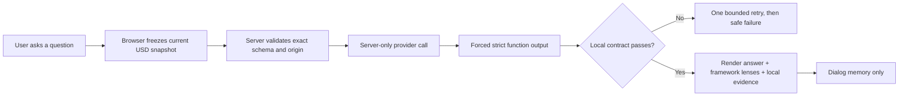
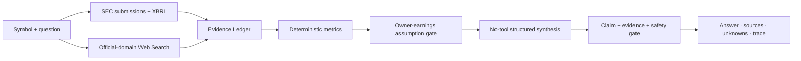

# Stock Portfolio + Buffett Framework Advisor

An iPhone-first portfolio PWA that keeps financial math deterministic, supports an evidence-bound Buffett-inspired portfolio coach, and demonstrates an official-source AAPL/MSFT AI research pipeline.

The product records and values a portfolio; it does not place orders, recommend trades, promise real-time prices, or impersonate Warren Buffett. The advisor is a method simulation based on public value-investing principles and is not affiliated with Buffett or Berkshire Hathaway.

## Why this is an AI product

The calculator already knows exact quantities, costs, cash, delayed valuations, P/L, concentration, and daily contribution. Those facts are deterministic. AI is used only where language and judgment help:

- interpret a user's open-ended question;
- choose the relevant value-investing lenses;
- challenge assumptions and identify missing evidence;
- explain portfolio structure in plain language;
- continue a bounded multi-turn consultation.

The model never becomes the source of truth for a price, weight, return, or portfolio mutation. If a question requires business quality, management, capital allocation, owner earnings, debt, intrinsic value, or margin-of-safety evidence that the current snapshot does not contain, the advisor must stop at an evidence gap instead of filling it from model memory.

## Ask directly from the portfolio

The home screen keeps three separate tools:

- **Portfolio analysis** produces a six-dimension, evidence-linked snapshot review and AI-inferred instrument/sector classification.
- **Buffett framework advisor** opens with the input focused and makes no request until the user sends a question.
- **Buffett research system** sends only an AAPL/MSFT symbol and question, retrieves SEC/XBRL and official-domain Web Search evidence, runs deterministic calculations, and shows the answer beside sources, unknowns, counter-evidence, and a research trace.

Each accepted answer identifies one to three explicit lenses:

`circle of competence` · `durable business` · `management & capital allocation` · `owner earnings` · `financial strength` · `intrinsic value & margin of safety` · `opportunity cost` · `temperament` · `evidence gap`

The UI translates those machine-stable values into readable labels and displays the exact local evidence used by the answer.

## AI system path



The shared contract rejects unknown fields, invalid decimals, unknown evidence references, unrecognized framework lenses, generated numeric claims, URLs, external-news claims, direct trade instructions, malformed provider output, and over-limit payloads. The model cannot write positions, cash, quotes, history, or account state.

## Buffett research system



The first slice supports AAPL and MSFT only. SEC facts are the canonical numeric lane. OpenAI Responses Web Search is restricted to SEC and issuer-owned domains and receives no portfolio quantities, costs, cash, or account data. Final synthesis has no tools and can reference only evidence ids enumerated by the server.

`operating cash flow - total capital expenditures` is displayed only as a free-cash-flow proxy. Owner earnings remains assumption-required until maintenance capital expenditure and incremental working capital are reliably separated.

See [the full AI system contract](docs/AI-SYSTEM.md) and [ADR-050](docs/adr/ADR-050-BUFFETT-RESEARCH-PIPELINE.md).

## What the advisor knows

| Available in the current request | Explicitly unavailable unless separately supplied and verified |
|---|---|
| symbols and instrument names | current filings and shareholder letters |
| quantity, cost, delayed valuation, P/L | durable moat evidence |
| position/cash weights and concentration | management quality and capital-allocation record |
| current cash and quote metadata | owner-earnings normalization |
| current daily contribution coverage | intrinsic-value range and margin of safety |
| recent successful dialog turns | live news, ETF look-through, factor risk, benchmark attribution |

This distinction is intentional: a Buffett-style vocabulary without the required evidence would be theater, not investment judgment.

## Privacy and credential boundary

The public snapshot contains synthetic data only. It contains no holdings, broker exports, account identifiers, portfolio backups, real-balance screenshots, emails, API keys, deployment account IDs, production origins, or database bindings.

Runtime behavior is different and is disclosed in the advisor: sending a question transmits the current USD portfolio snapshot—symbols, names, quantities, costs, valuations, P/L, cash, and quote metadata—through the operator's server to the configured model provider. It excludes names, emails, broker account identifiers, device identifiers, history databases, backups, drafts, clipboard data, and internal storage metadata. Closing the dialog clears the in-memory conversation.

The separate research system has a narrower boundary: it sends only the selected AAPL/MSFT symbol and research question to OpenAI Web Search. SEC retrieval and deterministic calculations run server-side; no holding quantity, cost basis, cash, or account state enters the research request.

Credentials are server-only:

- never use `NEXT_PUBLIC_` or `VITE_` for provider secrets;
- keep real values in ignored `.env.local` or managed sensitive environment variables;
- [`.env.example`](.env.example) contains placeholders only;
- provider responses are `no-store`, and request bodies/raw model output must not be logged;
- `PORTFOLIO_AI_ENABLED=false` is the server-side kill switch.

Before publishing changes, run:

```bash
npm run public:check
```

The gate scans publishable files for common credentials, client-exposed secrets, environment files, private keys, databases, HAR/log captures, portfolio backups, and broker exports. CI also scans Git history. See [SECURITY.md](SECURITY.md) for the complete boundary.

## Deterministic portfolio capabilities

- one canonical portfolio model across multiple input sources;
- exact decimal quantity, cost, average price, cash, and P/L calculations;
- delayed-market valuation with explicit source and timestamp semantics;
- atomic backup restore with empty-target and revision checks;
- authenticated current state with compare-and-swap protection;
- account, market-data provider, and AI trust boundaries;
- mobile accessibility, offline behavior, and failure-state design.

## Run locally

Requirements: Node.js 22 and the committed npm lockfile.

```bash
npm ci
cp .env.example .env.local
npm run dev
```

For a credential-free visual review, append `?fixture=ready` to the printed local URL. This development-only view uses the committed synthetic portfolio fixture, makes no account or market-data request, and labels the data as synthetic in the interface.

The default example keeps AI disabled. Portfolio consultation uses server-side `DEEPSEEK_API_KEY`. Buffett research uses server-side `OPENAI_API_KEY`, `SEC_RESEARCH_USER_AGENT`, and an explicit `BUFFETT_RESEARCH_ENABLED=true`. Optional delayed market data uses the server-side Alpaca variables in `.env.example`. No credential belongs in browser code or Git.

## Verification

```bash
npm run public:check
npm run audit:prod
npm run typecheck
npm test
npm run eval:buffett
npm run build:domain
npm run build:next
npm run bundle:check
```

The current public snapshot passes 614 automated tests. The dedicated [Buffett research eval](evals/buffett-research/results/latest.md) passes 9/9 credential-free synthetic cases. That demonstrates reproducible contract behavior, not live retrieval freshness, citation entailment, investment performance, user adoption, model quality, or financial outcomes.

## Architecture

- **UI:** Next.js/React with an iPhone-first PWA surface.
- **Domain:** framework-independent Decimal portfolio, cash, market, history, and backup modules.
- **Authenticated app:** account-isolated current state with revision-based conflict protection.
- **Provider service:** market data, FX, instrument resolution, DeepSeek consultation, SEC research, and OpenAI Responses Web Search behind exact-origin CORS.
- **AI contract:** strict schemas, Evidence Ledger, official-domain source controls, deterministic numeric rendering, value-investing lens enum, output rejection, and explicit assumption gaps.
- **Storage:** D1 current state plus device-local drafts and replaceable caches; AI chat is not persisted.

The snapshot uses non-production example origins in [`application/http/provider-proxy-contract.ts`](application/http/provider-proxy-contract.ts). An independent deployment must replace both origins together and configure its own server credentials. No production hosting manifest or live account identifier is included.

## Ownership and evidence boundary

This is an independent product and engineering project. I owned the product scope, PRD and ADR set, architecture, implementation, release gates, production deployment, incident diagnosis, and security hardening. AI coding agents supported implementation and review under my direction; I reviewed changes and verified releases through automated tests and reference builds.

The repository demonstrates a shipped system and decision discipline. It does not claim external adoption, investment performance, validated advice quality, or business outcomes.

## Documentation

- [Product requirements](docs/01-PRD.md)
- [Domain calculations](docs/02-DOMAIN-AND-CALCULATIONS.md)
- [UX specification](docs/03-UX-SPEC.md)
- [Technical specification](docs/04-TECHNICAL-SPEC.md)
- [Acceptance criteria](docs/05-ACCEPTANCE-CRITERIA.md)
- [Test strategy](docs/06-TEST-STRATEGY.md)
- [AI system and prompt stack](docs/AI-SYSTEM.md)
- [Architecture decisions](docs/adr/README.md)
- [Security policy](SECURITY.md)

The public value-investing references are Berkshire Hathaway's [annual-letter archive](https://www.berkshirehathaway.com/letters/letters.html) and [Owner's Manual](https://www.berkshirehathaway.com/owners.html). They provide method context, not endorsement of this product.

## Public-snapshot note

This clean snapshot is derived from the full application while keeping private provider deployment history and wiring separate. Public source code shows the trust boundaries and adapters; operators bring their own accounts, keys, budgets, origins, and data.

## License

No open-source license is granted. The source is public for portfolio review and technical discussion; all rights are reserved.
