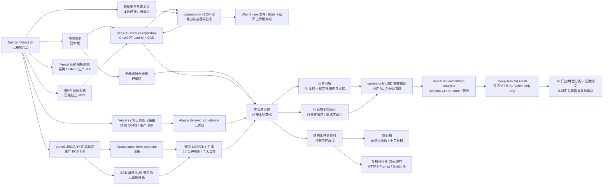

# 技术规格

状态：Active  
最后更新：2026-08-22（统一组合现金修订）

## 1. 当前结论

- `[用户确认 2026-07-30；2026-08-20、2026-08-22 修订]` 产品只有一个统一展示组合，不提供自由券商账户管理。启用 v4 后，校准和交易固定选择 IBKR/moomoo 以维护来源持仓；现金在产品中只显示一个组合池。
- `[用户确认 2026-07-30]` 所有录入使用同一套持仓计算；相同标的合并，首页只展示总仓位，不展示券商拆分。
- `[用户确认 2026-08-08]` 首页删除无功能的账户身份、导航和资产类别标签；顶部只保留总仓位、币种切换和更多操作，总资产下方固定为 2 × 2 核心指标，底部唯一“录入资产”再选择股票或 IBKR 现金。刷新、导出和复制收入更多操作。
- `[用户确认 2026-08-09；2026-08-12 修订]` 首页总资产、今日收益、趋势和 2 × 2 指标使用 Robinhood-inspired 连续纯黑英雄层级；趋势只保留 SIP 当前持仓“今日走势”。不显示长期周期、历史入口或历史导入页，缺真值时不画假线。
- `[用户确认 2026-08-20；2026-08-22 修订]` v4 book 在账号 state 中与旧 v3 逻辑隔离；只有校准确认后 Controller 才投影其统一股票与组合现金。BUY/SELL 对一条 current book 做原子读改写，事件 id 与 revision 提供幂等和并发保护；Sites 物理写入 D1，旧 Vercel origin 才保留 IndexedDB v4 store。
- `[用户确认 2026-08-22]` 用户可见现金改为一条统一组合池；全部受支持股票共用相同 BUY/SELL 现金公式，没有 BOXX/SGOV 特例。底层双现金分量只为兼容 current、结算与 IBKR 利息口径继续保留，D1/IndexedDB/JSON v3 schema 不迁移。
- `[用户确认 2026-08-20]` Production 为双运行时：Sites 独占 UI、ChatGPT 登录和 D1 current；Vercel 只代理标的解析、当前行情、日内条形、USD/CNY 和 AI。浏览器仅在精确 Sites origin 下改用固定 Vercel origin；CORS 无 credentials，CSP 只新增该单一 `connect-src`，Vercel 不持久化账号 current。
- `[用户确认 2026-08-22]` ADR-047 增加一个不含资产的静态例外：版本化 PWA PNG 由固定 Vercel `/icons/` 匿名提供；Sites metadata/manifest 使用绝对 URL，CSP `img-src` 只增加该 origin。provider API 的精确 CORS、页面 owner-only 和 D1 current 不变。

### 停用的独立历史数据边界

`[用户确认 2026-08-12]` 以下模块退出运行路径：`PortfolioController` 不打开历史 repository、不查询长期系列、不自动写入 NAV，`/history` 重定向首页。保留这些约束只为保护既有本机数据和停用代码，不能作为重新启用授权。

- `stock-portfolio-calculator-history` 与 current v3 数据库完全分离；历史导入不打开 current 库写事务。
- 浏览器端 PDF.js 只提取文本层；粘贴文字、CSV/PDF/TXT 原始 bytes 与文本只存在于当前页面内存。持久化层只接收已校验规范记录、SHA-256 资料指纹和不可逆来源范围。
- 一次性历史预览链接使用 `#history-text=<base64url UTF-8>`；最大解码载荷为 128 KiB。组件在解析前用 `history.replaceState` 清除 fragment，随后复用普通文本解析器。fragment 不进入 HTTP 请求；解析失败、阻断或未确认都零写入。
- `[外部事实 2026-08-11]` Apple 说明 iOS/iPadOS 主屏幕 Web App 与浏览器后续不共享本地网站数据；因此外部链接落到非 standalone 浏览器时只能预览并提示存储隔离风险，不能据此断言既有 PWA 已收到历史。目标 iPhone 的链接落点仍需实机验证：<https://webkit.org/blog/14787/webkit-features-in-safari-17-2/>
- 导入、重复检查、事件写入和活动构建切换位于一个历史库 `readwrite` 事务；冲突或写入错误整批回滚。
- 长期系列在浏览器用 Decimal 和 Modified Dietz 构建；服务端不接收 NAV、账户号、股数、交易或现金流。
- `[用户确认 2026-08-15]` 固定个人 Production 启动载荷、一次性 `localStorage` 标记逻辑和 `PortfolioController` 自动恢复调用全部移除。首页启动只读取现有 current；新来源为空时发布真实空组合，不调用 `restoreCurrentBackup()`。
- `[实现事实 2026-08-15]` 功能提交 `058d3f8` 已删除 `application/bootstrap/personal-production-bootstrap.ts` 及其运行引用，并进入 GitHub `main` 与 Vercel Production。这项变更不打开资产写事务、不升级 schema、不清理旧标记，已有 IndexedDB current 和独立历史数据库保持原样。完整 `npm run check` 通过 59 文件/490 测试与两项构建；`nanoid` override 更新到修复版 `3.3.18` 后，生产依赖审计为 0 个已知漏洞。运行源码、本地产物和生产 17 个首页静态 chunk 的旧载荷扫描为空；隔离新来源、遗留标记与合成既有股票/现金 current 的 Production smoke 通过。
- `[实现事实]` 仓库已经有 TypeScript 领域计算、无券商持仓 contract、IndexedDB 快照 repository、同步端口、行情刷新边界和 Alpaca `delayed_sip` / `overnight` adapter。
- `[实现事实 2026-08-03]` P0 页面与 API 的实际模块入口、存储位置、测试映射和未接入资产已经按模块登记在 `10-MODULE-IMPLEMENTATION-MAP.md`；代码存在或被测试覆盖不等于已经进入运行链路。
- `[实现事实]` 旧 `domain/ledger/` 仍要求 `brokerAccountId` 并产生 `BrokerPosition`；P0 新 contract 位于 `domain/positions.ts`，页面和新接口不得依赖旧模型。
- `[用户确认 2026-07-30]` 首个实现切片聚焦统一录入和总仓位 PWA UI；领域使用无券商持仓 contract。
- `[用户确认 2026-07-30]` P0 按标的采用当前持仓快照批次；普通录入与“加仓”叠加新输入，“修改持仓”回填当前合并数量与均价并替换当前批次；首页不显示历史恢复入口。
- `[用户确认 2026-07-30；2026-08-20 修订]` 旧 Vercel 来源保留 IndexedDB；Sites Production 必须 ChatGPT 登录，D1 按稳定 Sites user id 保存账号 current，同一账号跨设备读取。IndexedDB 只保留设备草稿与可替换缓存。
- `[用户确认 2026-07-30]` 首页需要把当前手机中已保存的持仓手动导出为 JSON；导出和后续修改不得弄丢现有数据。
- `[用户确认 2026-08-09；2026-08-20 修订]` JSON v2/v3 只允许恢复到账号股票、现金与 v4 book 都为空的组合；先在当前设备严格校验并预览，不合并、不覆盖。二次确认后，repository 在同一次 D1 state compare-and-swap 中复查空目标并写入规范化 current，失败零变化。源 revision 不继承，恢复记录固定 `revision=1`、`nextRevision=2`、`previous=null`；原始文件、草稿、行情/汇率缓存、legacy 或同步状态不进入 D1。
- `[用户确认 2026-08-09]` 组合结构使用已定价股票市值加现金本金作为分母；缺价明确部分口径。组合今日净额只在全量可计算时生成，绝对贡献按单股今日变化绝对值占可计算股票绝对变化总量计算，缺失不补 `0`。
- `[用户确认 2026-08-13；2026-08-15、2026-08-20、2026-08-28 修订]` 首页提供独立“组合分析”和“巴菲特框架顾问”。两者共用严格 current-only schema v4；请求仍包含 `PORTFOLIO + IBKR/moomoo accounts + optional ibkrInterest`，CHAT/FOLLOW_UP 响应新增一到三个可验的价值投资 framework lenses。非冒充、证据缺口、安全输出、本机 Decimal 数字和无持久化是绑定边界。
- `[用户确认 2026-08-01；2026-08-09、2026-08-12 修订]` 首页为前 5、前 10、全部或单只资料提供普通复制与 ChatGPT 两个目标。两者复用同一 USD 事实文本和范围 contract；普通复制只写剪贴板并留在 PWA，ChatGPT 路径复制后通过 `https://chatgpt.com/?prompt=` 预填待发送 Prompt。均不自动发送或调用 OpenAI API，失败时使用目标对应的手工回退。
- `[用户确认 2026-08-03]` 复制资料面向 AI 建议使用组合摘要与紧凑持仓表；逐股行情排障元数据压缩为组合级行情口径、价格时间范围和上一有效价/隔夜指示价标记，不改变底层行情 contract。
- `[用户确认 2026-08-02]` 首页提供 USD / 人民币显示模式；人民币金额从未舍入 USD 真值和一笔有效 USD/CNY 汇率派生，不建立第二套成本或汇兑盈亏。汇率优先使用 Alpaca `USDCNY` 中间价，失败时使用欧洲央行日参考交叉汇率；双源与缓存均不可用时继续显示 USD。
- `[用户确认 2026-08-02]` P0 增加一条本机 IBKR USD 现金记录，包含余额、Pro/Lite、IBKR NAV 和 NAV 来源。现金本金计入总资产，预估利息不写回本金或浮动盈亏；不连接 IBKR 账户。
- `[用户确认 2026-08-03；2026-08-08 修订]` 首页不设置独立今日入口或持仓表模式切换；总资产 2 × 2 核心指标中的“今日盈亏”主值是整个股票组合的今日盈亏估算金额，副值是组合涨跌幅。持仓表第四列固定显示累计盈亏/收益率，第五列主值显示逐股今日涨幅，下方小字显示逐股今日盈亏金额，不重复“估算”文案。计算使用当前数量、当前有效估值价和最近常规收盘价；夜盘也随行情刷新，IBKR USD 现金本金、NAV 和利息估算完全排除，缺少任一价格时不以零补齐。
- `[用户确认 2026-08-03；2026-08-08 修订]` 持仓表名称/代码列固定，其余数据列由表头、全部股票行和现金行共享的单一横向滚动容器承载。滚动区域同时允许横向浏览和页面纵向手势；点按或静止长按股票打开同一操作菜单，横向移动取消待触发长按并抑制随后点击；极窄宽度和文字放大不再切换两列布局。
- `[实现事实 2026-08-02]` `INDEXED_DB_POSITION_SCHEMA_VERSION` 已从 2 升为 3，升级只新增 `cash_accounts_v3`；原 `position_batches_v2`、`position_drafts_v2`、legacy backup 和行情 store 不删除、不重建。
- `[用户确认 2026-07-30]` P0 Web runtime 使用 Next.js App Router + React；Service Worker 与完整离线延后。
- `[用户确认 2026-07-30]` P0 只接受 Alpaca 可解析的 USD 美国上市股票与 ETF；受支持的美国上市存托凭证（ADR）可用。
- `[用户确认 2026-07-31]` 估值跟随盘前、常规盘、盘后和 24/5 隔夜时段；前三者使用 `delayed_sip`，隔夜使用 `overnight`。约 15 分钟延迟在页面级只披露一次；首页不显示逐行时段、行情日期时间、过期、上一有效价或隔夜提醒，内部行情元数据与安全降级保持不变。
- `[实现事实 2026-07-30]` 页面运行链路已串联 IndexedDB 持仓快照、普通录入与加仓叠加、合并数量与均价修改、确认删除、草稿恢复、标的解析、安全行情路由、IndexedDB 上一有效价缓存和刷新；首页不再查询或展示历史恢复操作。
- `[实现事实 2026-07-31]` TypeScript typecheck、领域构建、Next.js 生产构建和 27 个测试文件中的 233 项自动化测试通过；390 × 844 本地生产预览已验证账户身份与导航、3 × 2 资产指标矩阵、四列持仓表、持仓操作和无逐行行情时间或老化提醒，320 × 844 与 200% 根字号无横向溢出或关键数字裁切。既有空首页、多组十进制预览、草稿恢复、下载 JSON v1、无服务端密钥错误及导出前后 `position_batches_v2` 原始记录一致证据继续有效。上述代码后来进入累计提交 `a73ddcc`；真实 iPhone 文件保存未验证。
- `[实现事实 2026-08-01]` 本地实现已增加未舍入市值排序的结构化文本生成、范围/单只选择、同步触发的系统剪贴板写入和只读文本框回退；TypeScript、29 个测试文件中的 248 项测试、领域构建和 Next.js 生产构建完整门禁通过。复制交互已用 320/390/430 px 和 200% 根字号合成数据复核；真实 iPhone 粘贴仍待验证。
- `[实现事实 2026-08-02]` 本地实现已增加 Alpaca latest forex rates adapter、欧洲央行每日参考价 adapter、双源优先/降级 `/api/fx/usd-cny`、浏览器 client/cache、CNY ViewModel 与首页切换；TypeScript、33 个测试文件中的 283 项测试、领域构建和 Next.js 生产构建完整门禁通过。真实 ECB 响应已解析为 `ecb + REFERENCE`，无 Alpaca 凭据和 Alpaca 故障路径均返回可用降级汇率；无密钥 320 × 844 页面已启用人民币按钮、显示 ECB 来源且无横向溢出。生产发布、Alpaca 端点权限和真机尚未验证。
- `[实现事实 2026-08-03]` 本地实现保留逐股 `estimatedDailyChangeRate` 与组合/逐股今日盈亏估算 ViewModel；首页第五列直接消费逐股涨幅及 `dailyChange` 格式化金额，第四列累计盈亏不变，现金/缺失状态和展示简称由组件层处理，不新增存储或行情请求。五列表头、股票与现金行已置于同一横向滚动 region，第一列 sticky，横向 pointer move 继续复用长按取消阈值。390 × 844 合成持仓和 320/430 px 几何检查已通过；35 个测试文件中的 306 项测试及完整构建门禁通过。实际市场时段和真实 iPhone 尚未验证。
- `[实现事实 2026-08-02]` IBKR USD 现金的领域、repository、schema v3、表单、首页 ViewModel、JSON v2 和复制链路已接通；v2→v3 fixture 在升级与写入现金后保持股票 current、草稿及 legacy backup 不变。提交 `a73ddcc` 已进入 GitHub `main`，生产 `/cash` 返回 200；真实 Safari/IndexedDB 数据升级尚未验证。
- `[实现事实 2026-08-03]` `ui/portfolio-copy-text.ts` 已输出低噪音组合摘要与 Markdown 持仓表，并动态保留缺价、组合价格时间范围、上一有效价和隔夜指示价语义；35 个测试文件中的 305 项测试、TypeScript、领域构建和 Next.js 生产构建通过。尚未提交或发布。
- `[实现事实 2026-08-12]` 当前复制运行链路增加 `clipboard | chatgpt` 目标；Controller 复用同一文本生成结果并分派到普通剪贴板处理器或既有 ChatGPT 交付。Dashboard 已提供双入口、共享范围菜单、目标专属 Toast 与手工回退；真实 iPhone 外部行为验收尚未完成。
- `[实现事实 2026-08-08]` 首页组件已按 ADR-030 收敛；ViewModel 直接格式化既有未舍入 `portfolioOpenCost` 作为股票成本，不新增计算或存储。组件在横向位移阈值后同时取消长按并抑制补发点击；控制器不再在 Effect 清理时使同一实例的在途初始加载失效，避免 React StrictMode 重放后永久停在 loading。36 个测试文件中的 308 项测试、TypeScript、领域构建和 Next.js 生产构建通过；320/390 px 本地浏览器检查通过，未提交或发布。
- `[实现事实 2026-08-09]` 提交 `6e5832d` 已增加 JSON v2 严格解析/预览、空股票与空现金目标的单事务恢复、数据安全页，以及纯派生的组合结构与今日绝对贡献。自动化覆盖格式拒绝、重复标的、非空目标、并发竞争、现金写入失败回滚、部分定价、全量净额、正负抵消和零绝对变化；该提交已进入 GitHub `main`，生产 smoke 与真实 iPhone 验收仍待完成。
- `[实现事实 2026-08-09]` 本地工作区已新增 `domain/portfolio-trend.ts`、`/api/intraday-bars`、Alpaca Historical Bars adapter、浏览器 client、趋势图组件与高级首页视觉层。路由只接收 `instruments/asOf`，固定 `feed=sip`、`15Min`、`split`，且结束时间不晚于服务端当前时间减 15 分钟；股数、现金和组合派生留在浏览器，不写 IndexedDB。完整 `npm run check` 已通过 47 个测试文件、416 项测试、TypeScript、领域构建与 Next.js 生产构建。尚未发布，200% 文字、真实 iPhone 与真实市场时段尚未验收。
- `[用户确认 2026-07-30；2026-08-20 修订]` OpenAI Sites、Vinext/Vite/Worker、D1 与 owner-only 访问承载 UI/current；Vercel/GitHub `main` 承载 provider-only 后端并同时作为 legacy JSON 迁移来源。
- `[实现事实 2026-07-30]` Vercel 生产地址已就绪，GitHub 仓库已连接，Production 跟踪 `main`；功能提交 `7dbcdac` 自动部署为 Ready。生产首页、manifest、AAPL 标的解析以及 AAPL/MSFT 盘前 `delayed_sip` 有效估值价 smoke 通过，响应不含凭据字段。

v4 手工 BUY/SELL 已由 ADR-044 进入 current 维护；ADR-045 把 current 持久化迁到账号 D1。税务批次、长期收益、券商 API、跨账号共享和 Service Worker 不因部署自动进入。

## 2. 实现状态

| 能力 | 状态 | 证据或缺口 |
|---|---|---|
| TypeScript 领域模块 | 已实现 | `domain/` |
| 精确十进制 | 已实现 | `decimal.js`，领域边界使用十进制字符串 |
| 单元与属性测试 | 已实现 | Vitest、fast-check |
| 浏览器本地存储 | 仅辅助状态 | IndexedDB 保留表单草稿与上一有效行情；`localStorage` 保留汇率和提示时间，不再是 Sites 资产真值 |
| 手动 JSON 导出 | 已实现，真机未验收 | 账号 repository 只读活动 current；旧 current 导出 JSON v2，v4 book 导出 JSON v3。Web Share 优先与 Blob 回退已有自动化；文件不上传 Vercel provider，导出不改变 D1 或本机 schema |
| JSON v2/v3 空账号恢复与数据安全页 | Sites 已部署，真机未验收 | 当前设备严格解析和预览；服务端重验文档，在同一 D1 CAS 中复查 positions/cash/broker 全空并写 `revision=1/next=2/previous=null` current；非空、并发和任一失败均零变化 |
| 普通复制与 ChatGPT 交付 | 已实现并通过专项自动化；真机验收待完成 | 当前内存同步生成前 5、前 10、全部或单只文本；普通目标只调用剪贴板，ChatGPT 目标复用同一文本执行剪贴板与 HTTPS Prompt 导航，均不读写 IndexedDB 或调用 OpenAI API |
| USD / 人民币显示 | 已实现，真机未验收 | Alpaca `USDCNY` 中间价优先、ECB 同日 EUR 参考价交叉汇率降级、15 分钟刷新与 7 天缓存已覆盖；固定 Vercel provider Production 已返回 `ecb + REFERENCE` 200 |
| IBKR USD 现金 | 已接账号 repository，真机待验收 | contract、revision、录入/修改/删除、Pro/Lite、NAV、总资产/CNY/JSON/复制保留；Sites current 写 D1 |
| 来源持仓与组合现金 current book | Sites Production version 9，真机待验收 | 提交 `13387ef`；既有 v4 schema 与 JSON v3 不变。79 文件/585 测试、类型、领域与 Sites 构建通过，生产依赖审计为 0；owner-only version 9 部署成功，Production 静态资产包含统一现金池与交易预览标识 |
| 今日盈亏估算 | 已实现，真机未验收 | 领域层逐股与组合金额/涨跌幅、完整性规则及 USD/CNY ViewModel 已有自动化覆盖；首页以全股票仓金额为主值、组合涨跌幅为副值，夜盘合并 `overnight` 价和 `delayed_sip` 常规收盘参考，现金排除；当日数量变化不解释为券商真实当日盈亏 |
| 真实当日持仓估算线 | 已进入双运行时 Production，真机未验收 | Sites 页面经固定 Vercel provider 读取 Historical Bars；服务端只收标的和 `asOf`，数量/现金留浏览器派生且不持久化；自动化、生产 provider smoke 与本地浏览器 QA 已有证据 |
| 本机历史与长期收益 | 已停用并退出产品运行路径 | 独立历史 IndexedDB、解析和 Modified Dietz 代码为避免破坏既有本机数据而保留；首页无周期控件或入口，`/history` 重定向首页，控制器不查询或写入历史库 |
| 固定个人 Production 启动数据 | 已移除 | 新 Sites 账号保持空组合，不自动读取旧 Vercel origin；旧本机数据只经 JSON 明确迁移 |
| 组合结构与今日绝对贡献 | 已进入 Sites Production，真机未验收 | `ui/portfolio-insights.ts` 复用组合输入派生同分母结构、Top N、统一组合现金、完整/部分净额和绝对贡献；确定性模块不写存储、不依赖 AI 或请求新行情 |
| DeepSeek 组合分析与巴菲特框架顾问 | schema/prompt v4 已在本地实现，未发布 | 两个入口和 dialog 共用 schema v4；上一个 provider Production 证据仍是 schema v3，不能用来声称 v4 live quality |
| 旧同步边界 | 有实现但未接 P0 运行链路 | `application/sync/` 有本地 store、transport contract 和内存替身；首页与表单不导入，没有真实云端，且旧 adapter 不得与 P0 repository 同时拥有同名数据库 |
| 行情应用层 | 已实现并接页面 | 批量刷新、fixture provider、IndexedDB 上一有效价 store、单调缓存覆盖和前后台恢复刷新 |
| Alpaca 行情 | 已实现并配置生产凭据 | 按市场时段使用 `delayed_sip` / `overnight`；生产标的解析和盘前 `delayed_sip` 有效价已验证，实际隔夜 `overnight` 待时间绑定 smoke |
| 可操作 UI | 已接本地数据与安全 API | 首页、录入、预览、保存、刷新、更多操作及点按/长按持仓使用实际应用层；320/390 px 浏览器主状态已复核，含行情股票、200% 文字、VoiceOver 与真机仍待验证 |
| PWA runtime | Sites owner-only 与 Vercel 公开图标已部署，真机未验收 | Sites 提供 owner-only 页面、manifest、standalone metadata 与 ChatGPT 登录；Vercel 匿名图标 URL 已返回 `200 image/png` 和正确跨源/immutable header。Sites 登录态 metadata 指向和真实 iPhone 安装仍待验收 |
| Web 框架 | 已采用且构建通过 | Next.js App Router + React；见 ADR-013 |
| 标的解析 | 已接页面与服务端路由 | 输入代码后约 0.5 秒自动请求 `/api/instruments/resolve`；浏览器只提交 symbol，Alpaca resolver 返回规范市场与固定 USD 标的；生产 AAPL 解析返回 200 |
| 行情服务路由 | 已接页面并有自动化测试 | `/api/quotes` 使用 server-only Alpaca adapter、市场日历、24/5 fallback 和隔夜无成交回退；生产盘前链路已通过 smoke |
| 浏览器 E2E | 尚未建立 | `package.json` 有 Playwright 依赖与 `test:e2e` 脚本，但当前没有 `playwright.config.*`、E2E 目录或 spec，不能计作门禁证据 |
| Sites D1 与认证 | owner-only Production 已部署，跨设备真机待验收 | ChatGPT 登录守卫、`oai-authenticated-user-id` 分区、D1 migration、严格 `/api/portfolio`、CAS、云 repository 与空账号恢复已进入 Sites 运行包 |
| 部署 | Sites UI/D1 与 Vercel provider 双运行时已在线 | Sites 只接受 owner-only 私有发布；Vercel `main` 承载五个 provider 路由、legacy JSON 导出来源，并按 ADR-047 承载公开只读图标（图标生产就绪仍需独立 smoke） |

当前锁定的实现依赖：

- Node.js 22；
- TypeScript；
- `decimal.js`；
- `pdfjs-dist`；
- Vitest；
- fast-check；
- `fake-indexeddb`；
- Next.js；
- React。

App Router/React 页面 contract、Vinext/Vite/Sites Worker、D1 与 Vercel provider 已进入当前技术基线。其余未来依赖在对应实现开始时选择和锁定；文档不预先宣称 Supabase 或其他候选已经采用。

## 3. 当前代码边界

```text
domain/
  cash.ts
  decimal.ts
  fx.ts
  ledger/
  positions.ts
  portfolio.ts
  portfolio-trend.ts
  quotes.ts
  time.ts
application/
  cloud/
  fx/
    browser/
    server/alpaca-usd-cny-rate-provider.ts
    server/ecb-usd-cny-rate-provider.ts
  http/
  instruments/
    browser/
    server/
  positions/
    browser/copy-portfolio-text.ts
    browser/data-safety.ts
    browser/deliver-position-backup.ts
    position-backup.ts
  sync/
  market-data/
    browser/
    server/alpaca-market-data-provider.ts
    server/alpaca-intraday-bars-provider.ts
app/
  chatgpt-auth.ts
  api/portfolio/
  data-safety/
  api/fx/usd-cny/
  api/intraday-bars/
  api/instruments/resolve/
  api/quotes/
components/
ui/
  portfolio-insights.ts
public/icons/
tests/
db/
drizzle/
worker/
```

完整逐模块源码、运行入口、写入边界和测试索引见 `10-MODULE-IMPLEMENTATION-MAP.md`；上面的树只用于说明主要分层，不代表目录中的每个导出都进入 P0。

- `domain/` 不依赖 UI、HTTP 或 provider SDK。
- `application/sync/` 提供 IndexedDB、本地内存替身和同步编排。
- `application/market-data/` 提供批量刷新、fixture、浏览器 client 和 IndexedDB 上一有效价边界。
- `application/market-data/server/` 保存需要服务端密钥的 Alpaca adapter。
- `application/market-data/intraday-bars-api.ts`、浏览器 client 与 `server/alpaca-intraday-bars-provider.ts` 定义独立的当日 Historical Bars 读取边界；它不访问持仓 repository 或行情 IndexedDB 缓存。
- `application/fx/` 定义带 provider/rate type 配对的 `UsdCnyRate` contract、Alpaca 中间价 adapter、ECB 日参考交叉汇率 adapter、浏览器 client 与 `localStorage` 上一有效汇率缓存；它不读写持仓 repository。
- `application/http/parse-json-preserving-numbers.ts` 为 Alpaca 股票行情和汇率响应保留 JSON 数字原文，避免先经过 JavaScript 二进制浮点数。
- `application/instruments/` 提供受支持标的规则、浏览器 client 和 server-only Alpaca 解析器。
- `domain/cash.ts` 定义 IBKR USD 现金 contract、官方规则快照和十进制利息估算；`application/cash/` 定义现金快照 repository contract。
- `application/positions/` 提供按标的快照 repository，同一 IndexedDB adapter 以独立 store 实现股票与现金 contract。
- `application/positions/position-backup.ts` 同时定义版本化 JSON 副本、稳定文件名、严格解析和恢复预览；`application/positions/browser/deliver-position-backup.ts` 负责文件交付，`application/positions/browser/data-safety.ts` 负责浏览器持久存储状态和本地时间提示。
- `CloudPortfolioRepository.restoreCurrentBackup()` / `restoreBrokerPortfolioBackup()` 是 Sites 恢复写边界：服务端重验文档，在同一个 D1 CAS 中确认账号 positions/cash/broker 全空后写 revision 1 current；任何冲突或失败零变化。旧 `IndexedDbPositionRepository` 恢复只保留为 legacy 回归。
- `ui/portfolio-copy-text.ts` 从原始 `PositionSnapshot`、`ResolvedQuote` 与当前 `CashSnapshot` 生成排序、权重、排名、利息估算依据和展示文本；`application/positions/browser/copy-portfolio-text.ts` 只负责系统剪贴板写入和失败分类。
- `[目标，未验证 2026-08-09]` 浏览器交付边界还需把同一文本百分号编码进 `https://chatgpt.com/?prompt=` 并导航；该边界不得读取 repository、调用 OpenAI API、自动发送或接收回答。
- `ui/portfolio-insights.ts` 从与复制链路相同批次的股票、行情和现金源生成结构与今日贡献；它只使用未舍入真值并返回完整性状态，`components/portfolio-insights-sheet.tsx` 只格式化与管理详情交互。
- `app/`、`components/` 和 `ui/` 提供 Next.js 页面、manifest、表单预览、组合控制器与状态视图。
- `app/api/instruments/resolve/`、`app/api/quotes/` 和 `app/api/fx/usd-cny/` 提供 server-only 标的、股票行情与汇率路由，页面通过浏览器 client 调用。
- 标的解析路由只接受规范股票代码，不接受客户端指定的上市市场或币种；上市市场来自 Alpaca 资产响应，币种固定为 USD。
- Sites 使用 D1 `DB` 与分发层 ChatGPT 登录。`user_portfolios.user_id` 只保存稳定 Sites user id，不保存邮箱；`.openai/hosting.json` 只保存项目 ID 与逻辑 D1 绑定，不保存 secrets。
- 手动 JSON 导出不调用 Next.js API，不把持仓发送给 Vercel；用户在系统分享面板中选择的文件目标位于 App 控制边界之外。
- 持仓资料复制不调用 Next.js API，也不在用户点击后查询 IndexedDB；Controller 维护与当前首页同批发布的内存复制源。普通目标只调用剪贴板；ChatGPT 目标在 WebKit 用户手势内直接前往官方 HTTPS origin，不经过 Vercel 持仓代理，但会把 Prompt 带入外部 URL 边界。
- 人民币 ViewModel 从同一批原始股票快照、行情和现金快照重新计算，再乘以一笔有效汇率；不解析 USD 展示字符串，不修改复制源或 IndexedDB。
- 今日盈亏估算在 `domain/portfolio.ts` 使用未舍入十进制数量、估值价和 `previousRegularClose` 派生；ViewModel 只格式化金额、百分比和方向。CNY 金额从未舍入 USD 今日盈亏估算乘以同一笔有效汇率，不建立第二套真值。
- 当日趋势在 `domain/portfolio-trend.ts` 使用当前数量、前收、Historical Bars 和本机现金派生；只返回 `READY` 或带明确原因的 `UNAVAILABLE`，不读写 IndexedDB。组件只在最终绘图边界将十进制字符串转换为图表坐标，不用转换后的 `number` 重算金额或比例。

## 4. 统一组合目标模型

### 4.1 产品可见模型

P0 页面只处理：

- 股票标的；
- 当前持仓快照及其中的数量与成本输入；
- 按标的合并后的持仓；
- 行情及其状态；
- 组合总仓位或组合总览。
- 按当前股数估算的逐股与组合今日价格变化。
- 可选的单条 IBKR USD 现金快照与利息估算。
- 当前活动股票快照和现金快照的手动 JSON 导出副本。
- current-only JSON v2 的严格本机预览，以及只面向完全空组合的原子恢复。
- 组合结构、Top N 集中度、现金占比和今日绝对贡献的只读派生结果。
- USD / 人民币派生显示和带时间的有效汇率。

`[用户确认 2026-07-31 至 2026-08-08]` 首页固定为累计盈亏、今日盈亏、股票成本、现金本金组成的 2 × 2 核心指标，以及“名称/代码、市值/数量、估值价/均价、盈亏/收益率、今日涨幅”五列连续资产表；字段与可见状态以 `03-UX-SPEC.md` 为准。公司展示名只在 UI 删除常见法律实体和证券类型后缀，底层 `displayName`、标的键与复制资料保持原值。五列表头和全部资产行必须位于同一个 `overflow-x: auto` 滚动容器中；第一网格列使用 sticky 定位，所有网格行使用一致的最小宽度和列轨道，禁止逐行滚动或极窄两列重排。

股票持仓页面和公开应用接口不得要求或返回：

- 券商创建、选择或编辑；
- `brokerAccountId`；
- 券商名称；
- 券商拆分列表。

现金 contract 中的固定 `provider=IBKR` 及 Pro/Lite 只用于选择利率规则，不进入股票聚合键，不产生券商账户、股票券商归属或券商筛选。

相同标的的所有有效输入进入同一计算组。标的身份继续使用 `symbol + listingMarket + currency`，避免仅凭相同代码错误合并不同市场或币种。

P0 输入只接受 Alpaca 能正常解析的 USD 美国上市股票与 ETF。OTC、期权、加密货币和非美国市场在应用层保存前拒绝；美国存托凭证（ADR）只有在 Alpaca 将其作为受支持的美国上市股票正常解析时可用。

公式、精度、舍入和行情状态以 `02-DOMAIN-AND-CALCULATIONS.md` 为唯一真源。所有数量、价格、成本、金额和比例继续使用十进制字符串；展示层舍入值不得写回领域真值。

### 4.2 当前实现债

以下代码仍属于旧券商模型，但不再是 P0 新 contract：

- `LedgerEntryBase.brokerAccountId`；
- `BrokerPosition`；
- `foldBrokerPosition`；
- `calculateBrokerPositions`；
- IndexedDB 和同步 fixture 中携带的券商字段；
- 按券商命名的黄金样例与测试。

P0 隔离已经编码：

- 用户可见持仓 contract 使用 `domain/positions.ts`，没有券商字段；
- `domain/portfolio.ts` 使用 `UnifiedPosition`，不返回 `brokerAccountIds`；
- IndexedDB schema v2 为新股票快照建独立 store，并把旧 v1 账本复制到只读 legacy backup，不把它们解释为新快照；schema v3 只新增 IBKR 现金 store，不再复制 legacy 记录也不改写 v2 股票 store；
- 新快照与草稿测试使用无券商 shape。

剩余要求：

1. 页面、快照 repository 和新接口不能使用固定或隐藏的券商 ID。
2. P0 运行链路不能再让旧 v1 sync adapter 打开与新快照 repository 相同的默认数据库；否则存在 schema 所有权冲突。
3. 旧账本只作为非 P0 回归资产，不能暴露 BUY、SELL 或校准语义。
4. 真实 Safari 必须验证 schema v2→v3 升级前后股票快照、草稿、legacy backup 与行情缓存保持，以及现金写入失败恢复。

## 5. P0 当前运行链路

Sites P0 使用 App Router + React 页面、Vinext/Vite/Worker 构建和 CloudPortfolioRepository。D1 持有账号 current；IndexedDB 只持有草稿与行情缓存。标的、行情、日内条形、USD/CNY 和 AI 从 Sites 浏览器经固定 Vercel provider-only 后端获取；旧账本 adapter 与 outbox 不进入运行链路。



当前链路已支持用户在浏览器中：

1. 打开空组合；
2. 统一录入一只股票；
3. 通过同源 `/api/portfolio` 和 D1 CAS 原子保存该标的完整批次；
4. 刷新或同一 ChatGPT 账号换设备后从 D1 恢复；
5. 再次从普通录入入口保存同一标的时，把新输入原子叠加到当前批次并在首页看到一条重算后的合并持仓；
6. 从首页点按或长按选择修改时，回填当前合并数量与均价并原子替换该标的当前批次；
7. 从同一菜单选择加仓时，原子叠加本次数量与买入均价；选择删除时，经第二次确认且 revision 匹配后只删除该标的；
8. 在首页看到 2 × 2 核心指标和五列连续资产表；名称/代码固定，股票与现金按 UX 已确认字段在同一横向滚动区域展示；
9. 从“数据安全与恢复”只读导出 current-only JSON v2/v3，优先使用 Web Share 文件，必要时回退为 Blob 下载；
10. 在账号 positions/cash/broker 全空时严格预览并二次确认，把 JSON v2/v3 中的规范化 current 通过同一 D1 CAS 恢复；非空、无效、并发或写入失败均不合并、不覆盖且零写入；
11. 从首页两个并列入口分别打开独立详情：点按“组合分析”立即用 current-only USD 完整快照生成行业/角色分类和六维体检，并继续显示确定性结构与贡献；打开“巴菲特框架顾问”保持零请求且可直接输入，首次发送才固定快照，后续附最近六轮成功历史。每个回答显示一到三个 framework lenses；没有一手基本面时不伪造公司判断。两个 dialog 卸载后都清除内存结果，不写持久存储；
12. 从“更多操作”或单只股票菜单先选普通复制或 ChatGPT 目标，再完成前 5、前 10、全部或单只选择；两者复用同一低噪音文本。普通目标写入剪贴板并留在 PWA，ChatGPT 目标写入剪贴板并通过 `https://chatgpt.com/?prompt=<编码后的同一文本>` 打开待发送输入框；失败时使用目标专属手工回退，不修改持仓或调用 OpenAI API；
13. 在首页页面级看到一次约 15 分钟延迟披露；持仓行使用“名称/代码、市值/数量、估值价/均价、盈亏/收益率、今日涨幅”五列，不显示市场时段、行情日期时间、过期、上一有效价或隔夜提醒。缺价与请求故障仍明确呈现，首页不显示独立行情汇总卡；
14. 在 USD 与人民币模式间切换整页金额；数量、收益率和复制资料保持 USD 真值语义，无汇率时继续显示 USD。
15. 在总资产指标矩阵看到全股票仓今日盈亏估算金额主值和组合涨跌幅副值；夜盘有效行情刷新时两者同步更新。持仓表第四列固定为累计盈亏/收益率，第五列直接消费现有逐股 `estimatedDailyChangeRate` 与 `dailyChange`，分别作为主值和小字金额；缺少最近常规收盘价时显示 `— / 暂无`，现金显示 `— / 不参与`。
16. 从底部唯一“录入资产”选择股票或 IBKR 现金；账户身份、账户导航和无功能资产类别标签不进入首页。

浏览器页面不得直接导入 server-only adapter。`providerApiUrl()` 只在精确 Sites Production origin 下返回固定 Vercel origin，localhost 和 Vercel legacy 页面仍使用同源路径。Alpaca/DeepSeek secret 只能位于 Vercel 服务端运行边界；ECB 降级请求不使用密钥。

## 6. 账号存储、同步与旧本机数据

### 6.1 旧 Vercel IndexedDB 能力

隔离的旧同步 IndexedDB adapter 已实现以下能力，但没有被首页、表单或 API 导入：

- 账本记录、outbox 和同步游标；
- 源记录与 outbox 原子写入；
- 跨实例恢复；
- 幂等去重；
- 全部分页成功后一次提交；
- 用户命名空间隔离；
- 冲突状态保留。

这些旧同步能力和下列 IndexedDB current 继续用于 legacy 来源保护与测试，不进入 Sites 活动资产运行链路。

P0 快照 repository 已编码：

- 每个标的保存当前版本和上一成功版本；
- `addInputsToBatch` 在同一 IndexedDB 事务内读取当前批次、加入本次新输入并保存下一完整版本；并发普通录入按事务顺序保留各自输入；
- `replaceBatch` 使用 IndexedDB 事务按标的替换；
- `undoLatest` 仍作为未接入页面的内部历史能力保留；
- `deleteSnapshot` 在同一事务中删除指定标的批次与该标的草稿，并支持 expected revision 冲突检查；
- 保存领域批次草稿和录入页草稿；
- schema 升级时备份旧券商账本记录，不把它们静默解释为新快照。
- `cash_accounts_v3` 只使用固定键 `IBKR:USD`，保留 current、previous 和下一 revision；`replaceCashAccount` 与 `deleteCashSnapshot` 都支持 expected revision 冲突检查。
- v2→v3 升级只在同一 upgrade transaction 中创建 `cash_accounts_v3`，不遍历或 `put/delete` `position_batches_v2` 与 `position_drafts_v2`；不重复执行 v1→v2 legacy 复制。
- v3→v4 只创建 `broker_portfolio_v4`。该 store 使用固定 `CURRENT` 键保存完整 current/previous/nextRevision；升级事务不读取、遍历或改写旧股票、旧现金、草稿、legacy 或行情。
- `replaceBrokerPortfolioBaseline` 在单 store 事务内创建/替换校准 book；`applyBrokerTrade` 在同一条 current 上校验 event id、预期 revision、券商可卖数量并同时更新来源持仓、所选现金和事件。

这些能力有 `fake-indexeddb` 自动化测试并已接入页面；浏览器已验证录入草稿刷新恢复。`fake-indexeddb` 已覆盖 v2 原股票记录升到 v3 后原样可读、再写现金后股票不变，以及删现金不删股票。真实 Safari/iPhone 的完整保存、schema v2→v3 升级、legacy backup、容量异常和恢复路径仍未验证。

### 6.2 Sites P0 产品状态

Sites P0 使用一个严格云 repository 作为页面唯一资产边界：

- `app/chatgpt-auth.ts` 读取 Sites 身份；所有资产页面要求登录，`/api/portfolio` 缺少身份返回 401。缺少 forwarded user id 时，以规范化认证邮箱的 SHA-256 伪名键降级；
- D1 表 `user_portfolios` 以稳定 Sites user id 或邮箱 SHA-256 伪名键为主键，只保存 `state_version/state_json/created_at/updated_at`，不保存原邮箱；
- `state_json` 严格保存 legacy positions/cash 或 v4 broker book 的 current/previous；草稿、行情、汇率、备份文件和历史库不进入 D1；
- GET 只返回当前账号；POST 按实际字节读取 JSON、拒绝额外字段，并在服务端重新执行领域校验；
- 写入先校验领域 expected revision，再以 `WHERE user_id=? AND state_version=?` compare-and-swap；任一冲突返回 409 且零变化；
- `CloudPortfolioRepository` 实现原 Position/Cash/Broker/Restore contract；浏览器本机 `IndexedDbPositionRepository` 只被它用于表单草稿；
- `worker/index.ts` 在每次请求前安装 Sites runtime bindings；受限 helper 只读取 D1 `DB`，不依赖 Cloudflare 中不可用的 `process.env` 注入；
- Worker 不启用 `global_fetch_strictly_public` 也不直连 Alpaca、ECB 或 DeepSeek。固定 Vercel provider 内的 adapter 继续固定 HTTPS origin、拒绝/不跟随重定向并限制超时与响应大小；
- 同一账号在另一设备重新 GET 后读取同一 current；页面每次显式写入成功后缓存最新响应，刷新会重新核对云端。

下列 IndexedDB 语义继续定义旧 Vercel current 和云 state 内部 current/previous 的兼容 contract，但不再描述 Sites 的物理存储位置：

- 普通录入或“加仓”已有标的时，当前原始输入与本次新输入在同一事务中组成下一完整批次；
- “修改持仓”先聚合当前批次，再用用户提交的数量与平均成本单项替换该标的当前批次；
- 某标的新版本完整写入后再原子切换该标的活动版本；
- 写入或切换失败时继续读取该标的旧活动版本，其他标的不受影响；
- 每个标的上一成功版本可以作为内部故障防护保留，但页面不提供历史恢复入口；
- 删除经 UI 二次确认后，用 expected revision 原子删除指定标的当前/上一版本和该标的草稿；
- 页面刷新或重启后从所有标的活动版本原始输入重算；
- 新记录不包含券商字段。

IBKR 现金 contract 与股票快照分离。以下物理 store 语义只描述旧 Vercel IndexedDB 兼容适配器；Sites 的同一业务 contract 由 CloudPortfolioRepository 写入 D1：

- 余额、NAV 和利率计算输出都使用十进制字符串；只保存用户输入的现金 contract，不保存展示舍入或估算利息。
- legacy 适配器保存现金只对 `cash_accounts_v3` 开启 `readwrite` transaction；Sites 保存/删除现金使用账号 state mutation 与 D1 CAS，不使用这个 store 作活动真值。
- Controller 先读取股票，再独立读取现金；现金结构无效时发布股票 ViewModel 并显示未清空数据的提示。

ADR-044 v4 激活后：

- Controller 通过统一 repository 优先读取 `getBrokerPortfolioBook()`；存在时用 `projectBrokerPortfolioSnapshots()` 生成兼容行情/估值的统一 `PositionSnapshot[]`，并用 `projectBrokerPortfolioCash()` 生成统一组合现金源。在 Sites 中该 repository 读取 D1；此时不读取旧 IndexedDB 股票或现金作为活动资产。
- v4 book 只有校准确认才创建；校准组件读取旧 current 仅作表单参考，写事务只打开 v4 store。重复校准写 next revision 并保留 previous。
- BUY/SELL 页面使用标的解析边界和相同 repository；SELL 按 `broker + instrument` 查询可用数量，保存时对完整 book 执行单次 `put`。失败没有半成品 current。
- 旧 `/positions/new` 与 `/cash` 在检测到 v4 current 后转到 `/trades/new` 或 `/portfolio-setup`，避免写入不会被首页读取的旧 store。
- `PortfolioCashSource` 统一承载 legacy 或 broker cash。总资产、结构、复制与 AI 使用 `totalBalance`；IBKR 利息只从正已结算 IBKR snapshot 派生，现金上下文另带 IBKR/moomoo 分项。

旧 `application/sync/` outbox 仍不进入页面。Sites 的账号同步由 D1 current 读写直接提供，不复用旧 outbox；跨账号共享、自动合并、完整离线与第二数据库仍未确认。

### 6.3 手动 JSON 导出与空组合恢复

`[实现事实 2026-08-02]` 本地实现通过 `PositionRepository.listSnapshots()` 读取当前活动股票快照，并通过 `CashRepository.getCashSnapshot()` 读取当前现金快照。两者都是 `readonly` transaction；导出不调用任何替换、叠加、删除、草稿或内部撤销能力。

导出文件契约：

```text
format
formatVersion
exportedAt
snapshots[]
cash
```

- `snapshots` 保留当前 `PositionSnapshot` 的 `revision`、`savedAt` 与完整 `batch`；`batch` 保留标的、可选显示名称和全部原始 `PositionInput`；
- `formatVersion = 2`；`cash` 保留当前 `CashSnapshot` 或 `null`，包含 revision、保存时间和原始现金 account contract；
- 数量和成本继续使用十进制字符串；
- 快照按规范标的稳定排序，并拒绝同一标的出现两个 current snapshot；
- 不导出股票或现金 `previous`、持仓草稿、录入页草稿、上一有效行情缓存、legacy 券商账本备份、outbox 或同步游标；
- 生成文件不提升 `INDEXED_DB_POSITION_SCHEMA_VERSION`，不创建、修改或删除任何 object store；
- 浏览器优先把 `application/json` 文件交给 Web Share；不支持文件分享或非取消型分享失败时，创建临时 Blob URL 并触发本地下载，随后释放 URL；
- 关闭系统分享面板视为取消，不自动触发第二份下载；
- 导出过程没有备份文件上传 API；页面只从已认证账号 current 生成本地文件。

恢复只接受上述 current-only JSON v2，不提供通用导入：

- 严格解析器要求当前 `format`、`formatVersion=2`、精确字段集合、合法十进制/时间/源 revision，以及 P0 支持的 USD 美国上市股票/ETF；拒绝规范化重复标的与同一规范 symbol 跨多个受支持市场。现金 `navSource=CASH_BALANCE_FALLBACK` 时还要求 `netAssetValue=balance`。解析和预览阶段不打开写事务。
- UI 在二次确认前展示导出时间、股票/输入数量、股票数量与剩余成本、现金余额/NAV；空备份不恢复。
- Sites repository 在一个 D1 CAS 中重新检查 positions/cash/broker 全空。任一非空时抛出目标非空错误，不执行合并或覆盖。
- 所有股票与可选现金在该事务内用新增语义写入新的本地 current；源 revision 只完成合法性校验，不写入本地版本字段。恢复记录固定 `revision=1`、`nextRevision=2`、`previous=null`。任一写入、竞争或事务完成失败使整个事务回滚，最终零写入，并发恢复最多一个成功。
- 浏览器持久存储结果区分 `persistent`、`best-effort`、`unsupported` 和 `unknown`。只有 `persisted()`/`persist()` 明确返回 `false` 时是 `best-effort`；调用或属性读取抛错时返回 `unknown`，UI 不得把未知写成已拒绝。
- previous、草稿、行情/汇率缓存、legacy 备份、outbox 和同步游标不在恢复 contract 中；原始选中文件不持久化，确认后只上传规范化 current。

双券商账本使用并列而非伪装为 v2 的 JSON v3：

- `format=stock-portfolio-calculator-broker-portfolio-backup`、`formatVersion=3`，顶层只含 `format/formatVersion/exportedAt/book`；book 保留来源持仓、两条现金、current 维护事件与十进制字符串。
- 导出直接 clone 已校验 current book，不读取旧 v3 current、previous、行情、汇率、草稿或独立历史库。
- 数据安全页先按顶层 format 路由 v2/v3 严格解析器；v3 预览合并股票数、券商分项数、总股数、剩余成本和双现金。
- `restoreBrokerPortfolioBackup` 在同一账号 D1 CAS 中复查 positions/cash/broker 全空，只写 v4 revision 1 / previous null / nextRevision 2；源 revision 不继承，事件保留，失败零变化。

除已确认 v3 外的格式迁移、已有组合合并/覆盖、自动/云备份与跨设备恢复需要新的产品和迁移决定。

### 6.4 本机低噪音持仓复制与双目标交付

Controller 在每次发布首页 ViewModel 时，从同一批 `PositionSnapshot[]`、`ResolvedQuote[]` 和规范化 `PortfolioCashSource | null` 同步建立只读 `PortfolioCopySource`。legacy cash 被归一为单 IBKR 账户；v4 cash 带两家券商、已结算/待结算、账面合计与可选 IBKR 利息。文本生成器通过 `decimal.js` 对未舍入市值排序并计算权重，不解析格式化字符串。

范围 contract：

```ts
type PortfolioCopyScope =
  | { kind: "all" }
  | { kind: "top"; limit: 5 | 10 }
  | { kind: "single"; instrumentKey: string };

type PortfolioCopyTarget = "clipboard" | "chatgpt";
```

- Dashboard 把目标与范围分别传给 Controller。Controller 只生成一次文本，再按 `PortfolioCopyTarget` 分派：`clipboard` 调用普通剪贴板处理器；`chatgpt` 调用 ChatGPT 交付处理器。两者不允许为目标再读 repository 或生成不同内容。
- 普通复制同步调用 `navigator.clipboard.writeText()`，成功后不执行导航。ChatGPT 路径在用户选择最终范围的事件中先调用同一剪贴板 API，第一次 `await` 只能发生在写入调用之后，并复用该字符串构造 URL。
- 前 5/前 10 对 `marketValue` 十进制真值降序排序；缺价置后，同值或缺价之间先按代码、再按规范标的键稳定排序。
- 存在现金时，股票权重分母为组合 `pricedMarketValue + cashBalance`；缺价或分母为零时写“无法计算”。展示层金额、数量和百分比舍入不进入领域状态。
- 顶部只生成范围、USD 分钟级快照时间和一条组合级行情说明；价格时间范围从组合中已定价股票的 `sourceEventAt` 求最早/最晚分钟，无法解析的时间不得伪造。现金单独存在时省略股票行情说明。
- 组合摘要在完整定价时省略重复覆盖率和零值拆分；有缺价时输出缺价只数、未定价成本及排除边界。持仓用单一 Markdown 表呈现排名、代码/名称、数量、均价、现价、市值、盈亏、收益率和仓位。
- 逐股 `provider`、`feed`、`marketSession`、`valuationStatus`、`sourcePriceType`、`sourceEventAt` 与 `fetchedAt` 不直接展开；`usedLastValid=true` 用 `*`，`INDICATIVE_TRADE` 用 `†`。底层字段继续完整保留。
- `all` 范围在现金存在时紧凑输出 NAV 来源、Pro/Lite、免息额、计息余额、公布/NAV 调整/整笔现金利率口径、年/月利息估算和核验日；`top` 仍只筛选股票，但组合摘要保留现金余额与仓位。
- ChatGPT URL 固定以 `https://chatgpt.com/?prompt=` 为基址，并对完整文本做百分号编码；不得拼接未编码换行、`#`、`&`、`?` 或持仓文本。只允许官方 HTTPS origin，不使用未公开的自定义 URL scheme。
- 只有 `target=chatgpt` 的最终范围选择触发当前页面 HTTPS 导航。`target=clipboard` 不得构造 URL、调用 navigation port 或打开系统分享面板。Universal Link 是否由 ChatGPT App 接管属于外部运行行为；未接管时保留网页回落。
- ChatGPT 必须把 Prompt 留在输入框等待用户发送；PWA 不触发发送动作、不请求 OpenAI API、不持有 ChatGPT token，也不建立接收回答的回调、轮询或返回通道。
- Controller 的复制交付结果不得写入通用页面级 `notice`。Dashboard 在 `delivery=copied` 时按目标创建 `role=status` Toast：普通复制显示“已复制，可粘贴到其他应用”，ChatGPT 显示“已复制并打开 ChatGPT”。Toast 固定浮于页面之上且不参与布局；页面隐藏计时与重复替换规则保持一致。
- 自动写入失败返回 `manual-fallback`，UI 展示相同文本的只读 `textarea`。普通目标使用“系统未能自动写入剪贴板”的文案且不得提及 ChatGPT；ChatGPT 目标保留已尝试打开与手工粘贴说明。
- 点击任一目标都不调用 repository、行情 client、本产品 API 或 OpenAI API，不改变持仓、行情缓存、schema 或同步状态。普通复制没有外部 URL；ChatGPT URL 中的 Prompt 不得写入本产品日志、分析事件、错误上报、缓存或测试快照。
- `[实现事实 2026-08-12]` `copy-portfolio-text.ts` 与 `deliver-chatgpt-prompt.ts` 分别承载普通复制和 ChatGPT 交付；Dashboard 与 Controller 以显式 target 分派，组件测试覆盖两个入口、全部/前 N/单只目标参数、目标专属 Toast 与手工回退。真实 iPhone 的剪贴板、长文本、App/网页路由和 URL 隐私仍待验收。

### 6.5 组合结构与今日绝对贡献

`ui/portfolio-insights.ts` 复用当前页面同批 `PositionSnapshot[]`、`ResolvedQuote[]` 与 `CashSnapshot | null`，内部调用既有聚合、估值和今日变化领域函数。它不解析格式化文本、不读写 repository、不请求额外行情。

结构派生：

- `structureDenominator = Σ 已定价股票未舍入市值 + cashBalance`；单股、现金、Top 1/3/5 使用同一分母。
- 缺价股票保持 `weight=null`，不以成本或 `0` 代替，不进入分母；结果状态标记 `PARTIAL` 并返回未计价数量。
- 分母为零时全部结构占比不可用；排序按未舍入市值降序并使用稳定标的键打破并列。

今日贡献派生：

- 单股金额沿用 `estimatedDailyPriceEffect`。只有全部股票可计算时才返回组合净额；否则 `netEffect=null` 并返回覆盖数量。
- `absoluteDenominator = Σ abs(可计算单股金额)`；单股 `absoluteShare = abs(单股金额) / absoluteDenominator`。缺失项为 `null`，绝不补 `0`。
- 绝对分母为零时贡献占比全部不可用；最大正/负贡献依据带符号金额选择。现金始终排除。
- CNY 只在组件格式化层用当前有效汇率折算金额；占比、完整性与排序不变。

展示层只把已派生的十进制比例在最终绘图边界转换为图表坐标：仓位环图单独显示前 5 大股票，第 6 名起聚合成“其他股票”，但逐股数据不聚合；今日条形图先用未舍入十进制金额除以最大绝对金额归一化到 `[-1, 1]`，数值标签仍使用原始十进制 USD 或同笔汇率派生的 CNY。图表不参与排序、分母、持久化或业务判断。

### 6.6 DeepSeek 组合分析与巴菲特框架顾问

- `ui/portfolio-consultation-context.ts` 从当前 `PortfolioCopySource` 和 `PortfolioInsights` 生成 schema v4 request。现金为总账面余额、两家券商 settled/pending 分项和可选 IBKR 利息；它不读取 book revision、event id、旧/历史库、草稿、备份或剪贴板。
- `application/ai/portfolio-consultation-api.ts` 是浏览器、路由与 provider 共用的唯一运行 contract。schema v4 接受 `INITIAL_ANALYSIS`、兼容 `FOLLOW_UP` 与 `CHAT`；CHAT/FOLLOW_UP answer 必须携带一到三个唯一且在白名单内的 `frameworkLenses`。原模式、持仓、历史、证据和危险输出限制不变，并严格复核账户分项之和等于总现金。
- 初始响应必须按请求顺序对每只持仓返回一条 `AI_INFERRED` 分类：`instrumentType`、GICS 对齐 `sector`、`themes`、`confidence` 和 `rationale`。`ui/portfolio-consultation-context.ts` 再把已验证分类映射回当前未舍入 `assetWeight`，使用 Decimal 汇总行业与资产角色暴露；现金不分类，缺价不以成本或零补入。
- 初始 `brief` 固定包含资产/现金配置、集中度、行业/主题、工具/潜在重叠、表现/贡献和数据边界六个不重复维度，`questions` 固定为空。独立 CHAT `answer` 可回答问题，但只能引用已知基础 evidence，必须返回 framework lenses；模型正文不承载数字，组件根据引用使用会话开始时 USD/CNY 真值生成证据标签。
- `application/ai/value-investing-framework.ts` 维护顾问名称、非冒充披露、九个 lens enum/中文标签和系统政策。框架强制区分快照事实、框架推断、用户假设和未知；没有一手基本面时不得生成护城河、管理层、所有者收益或内在价值结论。
- `components/portfolio-ai-consultation-panel.tsx` 只拥有一次组合体检 state，挂载即使用打开时 props 请求，渲染分类、暴露和六维 brief；后台 props 刷新不替换该结果，失败只保留紧凑重试。`components/portfolio-ai-chat-dialog.tsx` 打开时不创建请求，空态披露方法与运行时数据边界；首次发送创建并保存固定请求快照，后续最多提交最近十二条消息，UI 最多保留二十四条。两个组件卸载或页面刷新后 state 清除，不写 IndexedDB、`localStorage`、导出或缓存。
- `application/ai/server/deepseek-portfolio-consultant.ts` 每次使用固定 system 说明、稳定快照前缀、固定确认消息和当前有限历史构建 messages。provider 固定调用官方 `https://api.deepseek.com/beta/chat/completions`，强制选择 `strict: true` 的 `return_portfolio_consultation` 函数并禁止重定向；INITIAL_ANALYSIS 的 schema 按请求动态列出每个 `positionId` 和六个维度，模型不能返回或改写 positionId/symbol/basis，服务端只把受限分类字段按原请求顺序重新附着。CHAT 只允许回答与基础 evidence，FOLLOW_UP 的既有分类由服务端原样附着。合法但过多的 evidence 在确认全量属于当前白名单且无重复后截为最多五项，未知或跨类引用仍整份拒绝。
- INITIAL_ANALYSIS 使用七千 token 上限与二十五秒总超时，CHAT 使用一千八百 token 上限与十八秒总超时，首次温度均为零。首个候选未通过本机 contract 时，不把原始候选重新注入上下文，只能在同一个 abort window 内使用模式专属修复指令完整重做一次。严格函数 schema 不能替代本机长度、文字、证据语义和安全校验。
- Vercel `/api/ai/portfolio-analysis` 当前代码只接受 schema v4；请求上限为 262,144 bytes，每实例每调用方每分钟十二次尽力限流，所有响应 `no-store`。Sites 页面要求登录，但 AI 费用仍必须使用 DeepSeek 受控余额作为硬上限。本地实现不等于已发布；生产仍需 schema v4 合成 smoke 和真机验收。
- `DEEPSEEK_API_KEY` 和 `PORTFOLIO_AI_ENABLED` 只存在 Vercel 服务端；后者为无需改代码的止血开关。上游空内容、截断、畸形 JSON、未知证据/持仓/分类、包含数字或直接交易指令的正文、429、超时和网络失败全部转成安全错误，不回显 provider body 或认证信息。确定性图表与持仓操作不依赖该路由。
- `application/ai/portfolio-analysis-api.ts`、`ui/portfolio-ai-facts.ts` 与对应旧 client/provider 为 ADR-039 的未删除遗留模块，当前运行组件与路由不再导入；不能使用它们推定当前产品数据边界。

### 6.6A AAPL/MSFT 巴菲特研究流水线

- `application/ai/research/supported-issuers.ts` 固定 AAPL/MSFT 的 CIK、公司名称与 SEC/官方 Web Search 域名。未支持 issuer 在任何上游调用前拒绝。
- `buffett-research-api.ts` 限制请求只含 schema/version/time/locale/symbol/question，定义 Evidence Ledger、metrics、owner-earnings assumption、claims/findings/unknowns/counter-evidence 和 trace contract。
- `sec-edgar-research.ts` 并行请求 `data.sec.gov/submissions` 与 `companyfacts`，使用服务端识别 User-Agent、固定 HTTPS origin、拒绝重定向、超时/字节上限和结构校验。首版只选取最新 annual revenue/net income/operating cash flow/capital expenditures 与最新 cash。
- `openai-buffett-research.ts` 第一次 Responses 调用使用 `store:false`、强制 `web_search`、实时联网、发行人官方域名 allowlist 和完整 source list；输入只有发行人与问题。第二次 Responses 调用没有 tools，只读 Evidence Ledger/确定性指标/假设缺口，通过 strict JSON schema 返回。
- `buffett-research-calculations.ts` 只在期间对齐时派生 net margin 和 `operating cash flow - total capital expenditures`；后者只是 free-cash-flow proxy。Owner Earnings 始终保留 `ASSUMPTION_REQUIRED`，不伪造维持性 CapEx。
- `/api/ai/buffett-research` 使用 32 KiB 请求上限、每调用方低频限流、60 秒平台上限与 45 秒内部总超时；所有响应 `no-store`。`OPENAI_API_KEY`、`OPENAI_RESEARCH_MODEL` 与 `SEC_RESEARCH_USER_AGENT` 只存在服务端。
- `portfolio-ai-research-dialog.tsx` 打开零请求，显示 issuer 选择、问题、隐私边界、确定性指标、所有者收益假设、framework findings、反证/未知、官方来源与 trace。研究结果不写持仓、D1、IndexedDB 或导出。
- `npm run eval:buffett` 为无凭据 synthetic 门禁；SEC/OpenAI provider 测试使用 replay payload。该证据不支持 live retrieval/citation quality 主张。

## 7. 行情边界

### 7.1 已实现

`application/market-data/server/alpaca-market-data-provider.ts`：

- 批量调用 Alpaca Stock Snapshot；
- 按市场时段显式指定 `feed=delayed_sip` 或 `feed=overnight`，并指定 `currency=USD`；
- 通过构造参数注入凭据、HTTP 客户端和时钟；
- 价格从 JSON 文本无损保留为十进制字符串；
- 保留 Snapshot 中用于当前市场时段比较的最近常规收盘价 `previousRegularClose`，供领域层计算今日盈亏估算；缺失时保持 `null`，不以当前价格或零伪造；
- 区分未授权、限流、服务故障、超时和单标的失败；
- 单标的失败不清空同批其他结果；
- 异常或较旧候选不能覆盖上一有效价。

`application/market-data/server/alpaca-market-calendar.ts` 与 `/api/quotes`：

- 使用 Alpaca `/v2/calendar` 修正节假日、提前收盘和有效隔夜交易日；日历不可用时按 `America/New_York` 标准 24/5 时段继续刷新；
- 盘前、常规盘和盘后请求 `delayed_sip`；隔夜请求 `overnight` 估值价并固定请求同批标的的 `delayed_sip` latest daily bar 作为最近常规收盘参考，缺少隔夜成交时同一笔 `delayed_sip` 行情作为估值回退；
- 周末、节假日或休市仍请求最近的 `delayed_sip` Snapshot，使没有浏览器缓存的新设备也能取得最后市场价，并标为休市最终价；
- API 凭据只通过服务端认证 header 发送，日历、标的和行情请求拒绝 HTTP 重定向，并有超时和响应边界；
- 页面可见时每 60 秒刷新，从后台恢复时补刷，并防止刷新请求重叠。

浏览器缓存写入前再次以行情 API 的服务端 `generatedAt` 经过领域校验，不依赖设备时钟判断候选新鲜度；事件时间或获取时间早于 IndexedDB 已存版本的响应不能覆盖较新缓存。服务端意外失败时页面保留浏览器中的上一有效价与原始时间。

### 7.2 Historical Bars 与本机当日趋势

`app/api/intraday-bars/route.ts` 只接受以下 JSON：

```text
{
  instruments: InstrumentKey[],
  asOf?: RFC3339
}
```

顶层或嵌套多出数量、成本、现金或其他字段时拒绝整个请求。路由重用受支持标的校验，限制标的数、请求大小、响应大小、分页次数、超时和上游重定向。密钥继续只存在服务端认证 header。

`AlpacaIntradayBarsProvider` 固定请求：

```text
GET https://data.alpaca.markets/v2/stocks/bars
feed=sip
timeframe=15Min
adjustment=split
currency=USD
sort=asc
```

查询窗口以 `America/New_York` 的当日 04:00–20:00 为界，但有效结束时间同时取 `asOf`、当日 20:00 和 `serverNow - 15 minutes` 的最早值。API 响应保留 `generatedAt`、`requestedAsOf`、`windowStartAt`、`availableThrough`、`provider=alpaca`、`sourceFeed=sip`、`delayPolicy=AT_LEAST_15_MINUTES`、`timeframe=15Min` 与 `adjustment=split`。浏览器 client 再次校验这些字段、点时间单调性和 15 分钟 cutoff。

Controller 从当前 `PositionSnapshot[]`、已解析快照的 `previousRegularClose` 与当前 `CashSnapshot` 建立本机输入，再与条形响应一起交给 `createPortfolioTrend()`。当日趋势不写入行情 IndexedDB、持仓 IndexedDB、汇率缓存或备份。刷新失败不清空已有持仓或当前估值。

现阶段不把快照 `overnight` 价连到 SIP Historical Bars。以后若接入，必须在所有持仓有同一真实时点价格时返回断开的 `OVERNIGHT_CURRENT` 点，不进行价格插值。

### 7.3 剩余验证与能力缺口

- 用真实凭据验证市场日历、节假日和提前收盘行为；
- 最新成交资格过滤；
- 分别验证 `delayed_sip` 与 `overnight` 的 schema、来源与时间合理性；
- 真实 iPhone 弱网和前后台恢复验证。

行情失败时在数据层保留上一有效价与原始元数据；不得回退为零，也不得把旧价格标为刚刚更新。首页可省略逐行老化状态，但从未取得有效价格时必须显示缺价，请求故障必须有紧凑提示。

### 7.4 USD/CNY 汇率边界

`application/fx/server/alpaca-usd-cny-rate-provider.ts` 请求 Alpaca `GET /v1beta1/forex/latest/rates?currency_pairs=USDCNY`，读取中间价 `mp` 与事件时间 `t`。`application/fx/server/ecb-usd-cny-rate-provider.ts` 在 Alpaca 未配置或失败时请求 ECB `EXR/D.USD+CNY.EUR.SP00.A` 最新每日参考价：

- 使用现有 `ALPACA_API_KEY_ID` / `ALPACA_API_SECRET_KEY` 服务端环境变量，认证 header、重定向拒绝和 10 秒超时与股票 adapter 保持同一安全边界；
- JSON number 先保留原文字面量，再规范为正十进制字符串；方向固定为 USD→CNY，`sourceEventAt` 不得晚于服务端 `fetchedAt`；
- ECB 请求固定使用 `lastNObservations=1`、`format=csvdata` 与 `detail=dataonly`，不发送认证 header；只接受同一参考日的 USD/EUR 与 CNY/EUR 正十进制值，并按 `CNY/EUR ÷ USD/EUR` 精确计算，provider/rate type 为 `ecb + REFERENCE`；
- ECB contract 保留 `referenceDate`，并使用官方响应 `Last-Modified` 作为 `sourceEventAt`；页面分别显示参考日和官方更新时间，不把它伪装成实时或中间价；
- `/api/fx/usd-cny` 先尝试 Alpaca，再尝试 ECB，只返回规范汇率 contract 或两个来源均失败时不含上游细节的安全错误，并使用 `no-store`；
- Controller 启动时与股票行情并行请求；前台每分钟调度检查，但两次汇率尝试至少相隔 15 分钟，手动刷新可强制尝试；
- 成功值写入 `localStorage` 键 `stock-portfolio:last-valid-usd-cny-rate:v1`。只有来源时间距当前不超过 7 天的值可以降级使用；缓存失败不影响当次在线值；
- 双源均失败且无可用缓存时清除人民币 ViewModel、禁用人民币模式并继续显示 USD。汇率请求与缓存均不访问 IndexedDB 持仓、JSON 备份或复制源。

真实 ECB 官方响应的 schema、十进制交叉计算、参考日和 `Last-Modified` 已通过 adapter smoke；生产仍需验证部署环境能访问 ECB，并用已配置的真实 Alpaca 账户完成优先端点权限和响应 schema smoke。

## 8. UI 与 PWA 最小技术要求

当前 UI 已包含并串联以下代码：

- Robinhood-inspired 连续纯黑英雄区，包含总资产、今日变化、真实当日线与 2 × 2 指标；以及固定名称/代码列、整表共享横向滚动的浅色五列股票/现金连续表；
- 统一持仓录入；
- 空数据、保存失败、行情缺失、过期和刷新中状态；
- 页面级单次约 15 分钟延迟披露，以及每行估值价、均价、市值、数量、盈亏和收益率；逐行市场时段、行情日期时间、老化和隔夜提醒不进入首页；
- iPhone 安全区域和触控尺寸；
- web app manifest；
- `display: standalone`；
- 图标、theme/background color；
- `apple-touch-icon`、favicon 与 manifest icon 使用固定 Vercel 的版本化绝对 HTTPS URL；Vercel 图标响应为公开只读、cross-origin PNG 和 immutable cache，Sites 仍拥有 manifest、`id`、`start_url` 与 scope；
- “更多操作”中的手动 JSON 数据副本、生成中状态、隐私提示、Web Share 文件交付和 Blob 下载回退；
- “数据安全与恢复”页面中的持久存储状态、最近生成/恢复时间、严格文件预览、空目标二次确认，以及成功/失败零写入说明；
- “更多操作”中的普通复制与 ChatGPT 双入口、共享范围菜单、动态前 5/前 10/全部/单只选择、股票行双入口、重复操作保护、目标专属 Toast 与手工回退；
- 总仓位标题区 USD / 人民币分段切换、整页金额 ViewModel、Alpaca 中间价或 ECB 日参考价来源说明、缓存标记和双源不可用提示；
- 首页 IBKR 现金空/已录入行、独立全屏表单、利息即时预览、来源披露和二次删除确认；
- v4 来源持仓校准页、买入/卖出表单、券商与现金状态分段控件、来源股数/组合现金前后预览、单条组合现金行、负现金和待结算语义；
- 总资产指标矩阵中的今日盈亏估算金额主值、组合涨跌幅副值，以及第五列逐股今日涨幅与小字今日盈亏金额、夜盘动态刷新、缺失状态和现金排除语义；
- 真实当日趋势的加载、可用、缺失与纯现金状态，以及指针/键盘探查、减少动效、USD/CNY 派生和不提供长期假范围的边界；
- 两个首页 AI 入口与独立 dialog；组合分析中的加载、行业/角色分类、六维体检、确定性结构/贡献、证据重绘和失败降级；巴菲特框架顾问中的打开零请求、直接输入、非冒充/隐私披露、framework lens 标签、连续历史、失败草稿、焦点管理与减少动效；
- 新版本更新时不破坏本地数据；
- 不注册 Service Worker，也不承诺完整离线应用壳或离线编辑。

首页股票区不得出现券商筛选或拆分；IBKR/moomoo 只在校准和股票来源选择出现，首页现金只显示统一组合池，不提供自由账户或现金账户管理。

Sites Vinext 生产构建、owner-only 私有部署和 D1 运行链路已经通过；Vercel Next.js provider 构建、精确 CORS、五个端点 smoke 与 ADR-047 公开图标 `200 image/png`/跨源 header 也已通过。这些结果不替代全部市场时段报价、完整浏览器 E2E、第二设备冲突、Sites 登录态 metadata 指向、主屏幕独立模式和真实 iPhone 验收。

## 9. P0 延后或未确认事项

以下内容不得写成 P0 要求：

- 税务批次、FIFO/指定批次、税务已实现盈亏和券商历史成交导入；
- 自动版本化云备份、跨账号共享和向非空账号合并/覆盖；登录、D1 current 与同账号跨设备读取已进入 P0；
- Service Worker、完整离线应用壳和离线编辑；
- D1 之外的 Supabase、Postgres 或外部认证服务；
- 隐私模式、除已确认 v3 外的格式迁移、向已有组合合并/覆盖、无人值守自动恢复和 CSV；
- 自定义域名与 D1 之外的云备份。

旧 `domain/ledger` 的 SELL 仍不进入运行路径。current BUY/SELL 只以 ADR-044 的 `domain/broker-portfolio.ts` 与 v4 book 为真源；不能据此推断长期收益或税务语义已经确认。

## 10. 安全边界

- `[用户确认 2026-08-17；2026-08-20 修订]` provider 部署继续按 ADR-043 分层加固。Vercel 五路由只允许同源调用或精确 Sites origin；其他跨站浏览器请求在调用上游前拒绝。POST 只接受 `application/json`，按实际 UTF-8 字节流限制大小并拒绝额外字段。Origin 检查只降低浏览器滥用，不能当作身份认证。
- Vercel CORS 只回显精确 Sites origin，禁止 `*`、cookie、Authorization 和 `Access-Control-Allow-Credentials`；preflight 只允许对应 GET/POST/OPTIONS 与 `Content-Type`，响应固定 `Vary: Origin`。Sites CSP `connect-src` 只是 `'self'` 加固定 Vercel origin，不扩大其他资源类型。
- 上一条只约束 `/api/*`。ADR-047 唯一例外是 `/icons/*.png`：允许 `Access-Control-Allow-Origin: *` 与 `Cross-Origin-Resource-Policy: cross-origin`，因为内容是无敏感数据的版本化静态图片；Sites CSP `img-src` 只增加同一个固定 Vercel origin。脚本、frame、font、worker、API credentials 与 D1 边界不扩大。
- Sites 不配置 Alpaca/DeepSeek secret，也不启用 `global_fetch_strictly_public`。Vercel provider 不提供 `/api/portfolio`，不接收 D1 revision、草稿、历史库或 JSON 文件。
- 每个路由使用调用方地址的截断 SHA-256 摘要执行有界单实例限流，不保存原始 IP；跨实例与机器人保护由 Vercel WAF/Bot Protection 承担。DeepSeek 仍必须设置 provider 余额或预算硬上限。
- USD/CNY 在线结果在单个服务实例内缓存十五分钟并合并并发请求；缓存保留原始 `sourceEventAt/fetchedAt`，API 对浏览器继续返回 `no-store`。其余行情不得为了缓存而伪造更新时间。
- 上游响应也必须有大小上限：标的、市场日历、股票 Snapshot、Historical Bars、Alpaca FX、ECB 和 DeepSeek 响应在解析前拒绝越界内容。
- 全站响应使用 CSP、HSTS、`Cross-Origin-Opener-Policy`、`Cross-Origin-Resource-Policy`、`X-Frame-Options`、`nosniff`、Referrer Policy 和 Permissions Policy；Next.js 支持的生产框架入口脚本使用 SHA-384 SRI，动态同源 chunk 继续受 CSP 限制。Next.js 当前只在 App Router 的 Webpack 构建中支持实验性 SRI，因此 Production build 必须显式使用 `next build --webpack`；在官方支持和真实 Vercel/PWA 验证完成前不得切回默认 Turbopack。当前 CSP 为兼容 Next.js 静态内联引导保留 `script-src 'unsafe-inline'`，后续收紧必须先通过生产构建与真实 PWA 验证。
- GitHub 必须启用依赖漏洞告警，并用固定 action SHA 的 CI 执行锁文件安装、npm 生产依赖审计、秘密格式扫描、typecheck、测试和生产构建。Vercel 生产构建本身也运行同一门禁，避免直接推送绕过 CI 后仍发布成功。
- 仓库、浏览器 bundle、日志和示例中不得出现真实 API key、token、邮箱、资产数据或固定个人资产启动载荷。
- Alpaca key 只允许进入服务端运行环境。
- DeepSeek key 只允许进入 Vercel Sensitive 服务端环境变量；provider origin 固定为官方 HTTPS 且拒绝重定向，不允许通过可配置 base URL 把认证 header 发送到其他 origin。
- 测试只使用合成持仓和模拟 HTTP。
- 用户导出的 JSON 含真实持仓数量、成本、IBKR 现金余额和 NAV，不得进入仓库、构建产物、日志、截图或测试 fixture；应用不得把文件内容上传 Vercel。
- 用户选取的恢复文件先在浏览器内解析；错误详情不得回显整份文件。文件大小与格式在请求前拒绝，Sites `/api/portfolio` 在写边界再次验证文档和全 current 空目标，并通过单次 D1 CAS 提交或零变化。
- 自动化与文档不得记录用户复制的真实持仓文本；剪贴板内容不得进入本产品日志、服务端错误或持久化缓存。普通复制不会产生外部 URL；ChatGPT 路径会把同一文本放入 `chatgpt.com` 请求 URL，因此自动化、截图、分析事件、导航诊断和错误回报不得保留完整 URL，只能使用合成持仓验证。
- DeepSeek 请求只使用合成资料做测试与 smoke。生产中只有点按“组合分析”或在“巴菲特框架顾问”发送才调用；请求会包含 current-only USD 快照中的真实股数、成本、价格、市值、盈亏、现金、NAV、行情时间和最近有限轮对话，不得包含姓名、账号、邮箱、设备标识、revision/savedAt、历史库、草稿、备份或剪贴板。顾问空态必须在发送前就地披露这两类字段。生产代码、Vercel 日志、分析事件和错误回报不得记录请求体、模型原始响应、真实会话或调用方原始 IP。
- `[用户确认 2026-08-20]` OpenAI Sites、D1 与 ChatGPT 登录已获本次构建和部署授权；新增付费服务、第二数据库、外部身份提供方或扩大访问人群仍需另行授权。
- 删除本地持仓前必须由用户对明确标的进行第二次确认；覆盖或迁移仍需恢复路径或明确确认。
- 旧 current 删除 IBKR 现金前必须独立二次确认；v4 不使用独立现金删除，交易通过一条 current 同时提交来源股票、统一组合现金变化与事件。

`[实现事实 2026-08-17，历史 Vercel Production]` `application/http/request-security.ts`、五个路由、上游 adapter、`next.config.ts` 与 `.github/` 已进入当时的 Vercel Production；其中请求、上游、响应头、日志和供应链加固继续用于当前 Vercel provider。当时“Production 公开且免登录”的页面决定已被 ADR-045 的 Sites owner-only 登录取代。

`[实现事实 2026-08-17，故障诊断与修复实现]` Production 的 Turbopack runtime 经 Vercel 工具栏注入后实际 bytes 与 HTML 的 SRI 不一致，浏览器会拒绝运行时并停在路由骨架屏。修复把 Production build 固定为官方 SRI 支持的 Webpack；同时把限流器与 FX 单实例缓存状态移入非路由模块，确保 App Route 只导出 Next.js 允许的 HTTP 方法和配置。完整门禁通过 67 个测试文件、540 项测试，本地生产 HTTP 返回的 5 个 SRI 脚本哈希全部匹配；Production 恢复结论以对应 commit 的正式发布和线上逐字节/真实浏览器 smoke 为准。

`[实现事实 2026-08-17，Production 恢复]` 修复提交 `8e1ef1f` 的 GitHub Security gate 与 Dependabot Updates 成功，Vercel deployment `83GXHywRK5scEM2pCMoMLw39iXQZ` 为 Ready。项目级 Production Toolbar 已固定为 Off；主域名使用 Webpack 且 5 个 SRI 脚本实际 SHA-384 全部匹配，没有 `vercel.live` 注入。Chrome 验证首页退出骨架屏并且控制台无 warning/error；manifest、标的、当前行情、SIP 15Min 条形和 USD/CNY 均通过 200 smoke。

`[实现事实 2026-08-20，provider-only Production]` `application/http/provider-proxy-contract.ts` 固定 Sites/Vercel 两个 origin，五个 browser client 只在 Sites Production 下转向 Vercel；`provider-proxy-cors.ts`、五个 App Route 和 `next.config.ts` 锁定精确 CORS/CSP。Vercel commit `e171abc` 已进入 `main`，Security gate `32356608866` 成功；75 文件/563 测试、Next.js Webpack build 和生产依赖审计 0 通过。Production 的 preflight 只回显 Sites origin，AAPL 标的、`delayed_sip` 行情、SIP 15Min 条形、ECB 汇率和合成 schema v3 AI 均返回 200。

## 11. P0 主路径完成条件

只有同时满足以下条件，才能说 iPhone PWA 主路径已验收：

- 首页统一持仓 contract 不展开券商；v4 内部只允许固定 IBKR/moomoo 股票来源，用户可见现金只有一个组合池；
- 用户能从首页点按或长按一个标的，修改、加仓、普通复制、复制并打开 ChatGPT 或确认删除；普通复制失败可手工复制，ChatGPT 路由失败可手工粘贴，刷新后活动版本不变；
- 前 5、前 10、全部与单只在两个目标中都复用同一文本；目标 iPhone 已验证普通复制留在 PWA 且可粘贴到其他应用，以及 ChatGPT App 接管、网页回落、长文本、待发送状态和手工回退，且未调用 OpenAI API、自动发送或记录完整 URL；
- 用户能从首页只读生成当前活动快照 JSON；格式、十进制字符串、排除项和取消失败不改数据已有自动化证据，真实 iPhone 的系统分享/文件保存另行验收；
- 用户能在账号全 current 为空时严格预览并二次确认恢复 JSON v2/v3；无效/空文件、非空目标、并发和任一写入失败都零变化，成功时 D1 current 固定 `revision=1`、`nextRevision=2`、`previous=null`，草稿和缓存不恢复；真实 iPhone 文件选择、D1 恢复和第二设备刷新另行验收；
- 成本录入可选择平均成本或剩余总成本，并支持同一标的多组数据；
- 普通录入已有标的时，新输入叠加到当前批次，保存前预览和首页结果均按全部输入重算；
- 叠加或替换形成的新批次按标的原子切换，失败不改变该标的旧版本或其他标的；删除只作用于已确认且 revision 匹配的标的；
- 相同标的只显示一份合并仓位；
- 首页没有券商管理或拆分入口；
- 行情通过安全服务边界返回，密钥不进入浏览器；
- 汇率通过同一服务端安全边界返回，整页 CNY 折算使用未舍入真值；Alpaca 优先、ECB 参考价降级、缓存、双源不可用和来源元数据规则通过，且不修改持仓或 USD 复制资料；
- 用户可从首页录入和修改 IBKR USD 现金，查看官方档位、NAV 调整、混合利率和年/月利息估算；利息不当作已入账资产或盈亏；
- 首页今日盈亏估算使用当前数量与最近常规收盘价精确派生；盘前、常规盘、盘后和夜盘参考选择、逐股与组合完整性、现金排除、CNY 金额折算、总览指标格正负语义均通过自动化与目标 iPhone 验收；
- 组合结构按已定价股票市值加现金本金的同一分母派生；缺价时标记部分口径。今日净额要求全量，绝对贡献按可计算股票变化绝对值分配，缺失与零分母不制造数值；详情通过自动化与目标 iPhone 验收；
- AI 只在点按“组合分析”或发送聊天问题后调用；打开聊天与输入草稿零请求。两种响应 schema、发送面和固定快照通过自动化锁定；数字本机重绘，未知证据/数字/外部归因/预测/交易建议整份拒绝，provider 故障不遮挡确定性详情。生产密钥、费用硬上限、合成 smoke 与目标 iPhone 状态通过；
- schema v2→v3 自动化和真实 iPhone 升级验收都证明原股票快照不变；现金保存/删除失败不破坏股票；
- 行情失败和过期在数据层安全降级且不会归零；首页明确显示缺价和请求故障，但不要求逐行显示老化状态；
- manifest、standalone 和真实 iPhone 主路径完成验证；
- 不支持的资产在保存前被拒绝，受支持标的解析与规范键经过验证；
- 类型检查、单元测试、集成测试和构建通过。
- Production 启动不包含固定个人资产模块或调用；全新 Sites 账号继续显示空组合且不写入 current/标记，旧 Vercel origin 的 current 和历史数据在 Sites 发布前后不变。
- schema v4 只追加 broker store；校准前后旧 v3 逐字段不变。确认校准后首页统一股票、单条组合现金、买入/卖出/校准、旧入口重定向和 CNY/复制/AI 聚合现金均通过。
- BUY/SELL 覆盖 AAPL、BOXX、SGOV 等不同标的、两个股票来源、碎股、手续费、移动平均部分卖出、全卖、待结算/已结算、负现金、超卖、重复 id、stale revision 与事务失败零变化；每次都断言组合现金按通用公式变化。JSON v3 导出/严格解析/三 store 空目标恢复继续通过。
