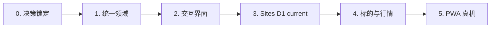

# 交付计划

状态：Active  
最后更新：2026-08-22（Sites/Vercel 双运行时同步）

## 1. 结论与目标

P0 按六个阶段推进，阶段出口证据通过后再进入下一阶段。最终闭环是：

```text
真实 iPhone：
空组合
→ 普通录入一个标的
→ 再次录入同一标的并自动叠加
→ 同一标的多组输入合并
→ 点按或长按修改合并数量与均价或录入加仓
→ 二次确认删除指定标的
→ Sites D1 CAS 原子写入
→ 刷新或同账号另一设备后恢复
→ 手动导出当前活动 current JSON v2/v3 且不改账号或本地数据
→ 在账号 positions/cash/broker 全空时严格预览，并通过单次 D1 CAS 恢复规范化 current，失败零变化
→ 查看组合结构、现金占比、集中度与今日绝对贡献，并识别完整或部分口径
→ 分别使用“组合分析”和“巴菲特框架顾问”：前者点按即生成 DeepSeek 证据约束体检，后者打开零请求、发送才建立固定组合上下文并持续交流；数字仍来自本机，失败保留确定性详情
→ 对前 5、前 10、全部或单只资料选择普通复制或 ChatGPT 目标；前者留在 PWA，后者进入待发送 Prompt，均复用同一文本且不改本地数据
→ 在 USD 与人民币估算间切换且不改持仓、收益率或 USD 复制资料
→ 录入 IBKR USD 现金并计入总资产，按 Pro/Lite、免息额和 NAV 规则查看利息估算
→ 升级、修改或删除现金都不改变已有股票数据
→ 在总资产指标矩阵查看整个股票仓的今日盈亏估算金额与今日涨跌幅
→ 查看页面级单次延迟披露、五列持仓表、逐股今日涨幅与小字今日盈亏金额、缺价与请求故障
→ 在连续纯黑英雄区查看唯一一条真实 SIP 15 分钟“今日走势”，数据不足时不画假线
→ 首页没有长期周期控件、历史入口或后台 NAV 写入
→ 从底部唯一“录入资产”选择股票或现金，并从“更多操作”刷新、导出或复制
→ 从更多操作进入来源持仓校准，确认 IBKR/moomoo 股票来源和底层现金分量；旧 v3 保留
→ 在任一来源买入或卖出，来源股票、费用、统一组合现金与事件同时更新或全部不变
→ 导出并在账号全 current 为空时恢复 JSON v3
```

绑定基线：

- `[用户确认 2026-07-30]` 统一组合，无券商管理；
- `[用户确认 2026-07-30；2026-08-12、2026-08-20 修订]` 旧 current 按标的快照；确认校准后，v4 双券商 book 由手工 BUY/SELL 驱动 current。长期历史与导入仍退出运行路径；
- `[用户确认 2026-07-30]` 成本录入支持平均成本或剩余总成本两种模式；
- `[用户确认 2026-07-30]` 普通录入与加仓叠加新输入，修改回填合并数量与均价并替换；首页不显示历史恢复入口，删除必须第二次确认；
- `[用户确认 2026-07-30]` P0 支持 Alpaca 可解析的 USD 美国上市股票与 ETF；
- `[用户确认 2026-07-30；2026-08-20 修订]` Sites Production 必须 ChatGPT 登录，D1 是账号 current 真值并支持同账号跨设备读取；IndexedDB 只保留设备草稿、行情/汇率缓存与 legacy 迁移来源；
- `[用户确认 2026-07-30]` 首页需要把当前手机中已保存的持仓手动导出为 JSON；导出和后续修改不得弄丢现有数据；
- `[用户确认 2026-08-09；2026-08-20 修订]` JSON v2/v3 只恢复到 positions/cash/broker 全空的登录账号；先在当前设备严格校验并预览，不合并、不覆盖，服务端在同一 D1 CAS 中复查空目标并写入规范化 current，任何失败零变化；源 revision 只校验，恢复记录固定 `revision=1`、`nextRevision=2`、`previous=null`，原始文件、草稿和缓存不进入 D1；
- `[用户确认 2026-08-09]` 组合结构分母为已定价股票市值加现金本金，缺价明确部分口径；今日净额只在全量可计算时显示，绝对贡献按可计算股票变化绝对值计算，缺失不补 `0`；
- `[用户确认 2026-08-13；2026-08-15、2026-08-28 修订]` 首页提供“组合分析”和“巴菲特框架顾问”两个独立入口；点按组合分析直接开始六维体检，顾问打开零请求、可直接输入、发送时才建立 current-only USD 固定快照。AI 推断行业/资产角色，本机 Decimal 汇总暴露并重绘数字；顾问不冒充本人，返回可验 framework lenses，没有一手基本面时明示证据缺口。运行界面不设明示同意步骤，但空态披露发送/排除字段；不提供目标价、收益保证、预测或直接交易指令；
- `[用户确认 2026-08-01；2026-08-09、2026-08-12 修订]` 首页为前 5、前 10、全部或单只结构化持仓文本提供普通复制与 ChatGPT 两个目标。两者复用同一文本；普通复制只写剪贴板并留在 PWA，ChatGPT 路径复制后通过 `https://chatgpt.com/?prompt=` 打开待发送 Prompt。均不自动发送或调用 OpenAI API，失败时保留目标专属手工回退；
- `[用户确认 2026-08-03；2026-08-09 修订交付]` 复制文本用于交给 ChatGPT 获取建议；输出继续使用低噪音组合摘要和紧凑持仓表，逐股排障元数据只保留全局口径与必要例外标记；
- `[用户确认 2026-08-02]` 首页支持 USD / 人民币显示模式；人民币金额使用一笔有效 USD/CNY 汇率从未舍入 USD 真值派生，只作估算，优先 Alpaca `USDCNY` 中间价并以 ECB 日参考交叉汇率降级；双源失败时使用合格的上一有效值或继续显示 USD；
- `[用户确认 2026-08-02]` 首页连续列表增加一条本机 IBKR USD 现金资产；用户录入余额、Pro/Lite 和可选 NAV。现金本金计入总资产，利息按官方档位、首 USD 10,000 免息和 NAV 比例估算；v2 升 v3 不能改写现有手机股票数据；
- `[用户确认 2026-08-03]` 首页不设置独立今日变化入口；总资产指标矩阵显示“今日盈亏”，金额为主值、今日涨跌幅为副值，两者随可用行情刷新；持仓表固定显示累计盈亏/收益率。今日指标按当前数量相对最近常规收盘价估算，现金本金、NAV 与利息排除，缺失不归零，当日数量变化时不等于券商逐笔交易口径的当日盈亏；
- `[用户确认 2026-08-08]` 首页顶部只保留总仓位、币种切换和更多操作；总资产下固定为累计盈亏、今日盈亏、股票成本、现金本金 2 × 2；底部唯一“录入资产”再选择股票或现金。股票点按或长按均打开操作，横滑后不得误触。
- `[用户确认 2026-07-30]` Next.js App Router + React；Service Worker 与完整离线延后；
- `[用户确认 2026-07-30]` 行情使用 Alpaca `delayed_sip`。
- `[用户确认 2026-07-31]` 行情跟随盘前、常规盘、盘后和 24/5 隔夜时段；隔夜使用 `overnight`。约 15 分钟延迟在页面级只披露一次；首页不显示逐行时段、行情日期时间、过期、上一有效价或隔夜提醒。
- `[用户确认 2026-08-12]` 首页只保留 SIP 15 分钟当前持仓“今日走势”；长期周期、历史入口、历史导入和后台 NAV 写入全部退出运行路径，既有本机历史数据不删除。

`[实现事实 2026-07-31]` 无券商持仓 contract、IndexedDB 快照与上一有效价 repository、首页与录入页、标的解析、安全行情路由、Alpaca adapter、manifest 和长按持仓操作已经串联；本地实现已增加版本化 JSON 备份、只读 current snapshot 读取、Web Share 文件优先和 Blob 下载回退。首页已整页重构为 Futu 账户页式浅色分区、3 × 2 资产指标矩阵和四列持仓表，逐行行情时间和老化提醒已移除。TypeScript typecheck、领域构建、Next.js 生产构建和 27 个测试文件中的 233 项自动化测试通过；390/320 px 与 200% 根字号生产预览无横向溢出或关键数字裁切。上述 UI 与备份代码后来进入累计提交 `a73ddcc`；旧账本仍保留历史券商模型。Vercel 功能提交 `7dbcdac`、AAPL 标的解析以及 AAPL/MSFT 盘前 `delayed_sip` 有效估值价 smoke 对应此前发布版本；实际隔夜 `overnight`、完整浏览器 E2E、真实 iPhone 文件保存和安装仍未验证。

`[实现事实 2026-08-01]` 本地实现已增加结构化持仓文本生成、范围/单只交互、系统剪贴板写入和手工回退；TypeScript、29 个测试文件中的 248 项测试、领域构建和 Next.js 生产构建完整门禁通过，复制菜单窄屏与 200% 根字号浏览器检查已完成。相关代码后来进入累计提交 `a73ddcc`；功能专项生产 smoke 与真实 iPhone 粘贴尚未完成。

`[实现事实 2026-08-03]` 复制生成器已改为低噪音组合摘要与 Markdown 持仓表，完整门禁为 35 个测试文件中的 305 项测试、TypeScript、领域构建和 Next.js 生产构建通过。尚未提交、发布或完成真实 iPhone 跨 App 粘贴。

`[实现事实 2026-08-09]` 代码已把剪贴板调用与 `https://chatgpt.com/?prompt=` 同步导航接入所有复制入口；专项测试覆盖调用顺序、完整 URL 编码、剪贴板失败仍导航、短暂成功 Toast 和页面隐藏计时。完整 `npm run check` 通过 42 个测试文件中的 388 项测试、TypeScript、领域构建和 Next.js 生产构建；基础交付已通过提交 `036ef60` 进入 GitHub `main` 和 Vercel Production，真实 iPhone App/网页路由仍待完成。

`[实现事实 2026-08-12]` 复制交付新增 `clipboard | chatgpt` 显式目标；“更多操作”和股票菜单均提供双入口，普通复制零外部导航，两个目标复用范围与文本生成器，并有目标专属 Toast、失败文案和组件测试。

`[实现事实 2026-08-02]` 本地实现已增加 Alpaca `USDCNY` 中间价优先、ECB 日参考交叉汇率降级、浏览器缓存、精确人民币 ViewModel 和整页切换；TypeScript、33 个测试文件中的 283 项测试、领域构建和 Next.js 生产构建完整门禁通过，真实 ECB 响应、无 Alpaca 凭据和 Alpaca 故障路径已验证。无密钥 320 × 844 页面已实际启用人民币按钮、显示 ECB 来源且无横向溢出；此前 390/430 px 与 320 px 200% 根字号证据继续有效。相关代码后来进入累计提交 `a73ddcc`；生产汇率专项 smoke 和真实 iPhone 尚未完成。

`[实现事实 2026-08-02]` IBKR USD 现金领域、独立 IndexedDB 记录、`/cash` 表单、首页列表与总资产、CNY、JSON v2 和全部资产复制已经实现；自动化证明 v2 股票 current、草稿和 legacy backup 在升级及现金写入后不变。提交 `a73ddcc` 已进入 GitHub `main`，生产 `/cash` 返回 200；真实 iPhone 升级尚未完成。

`[实现事实 2026-08-03]` 本地实现保留组合与逐股今日盈亏估算、缺失完整性、现金排除和 CNY 金额派生；首页第五列显示逐股今日涨幅与小字今日盈亏金额，第四列累计盈亏不变，并精简公司可见名称。五列表固定名称列、整表共享横向滚动已通过 390 × 844 合成持仓验证，320/430 px 页面主体无横向溢出；35 个测试文件中的 306 项测试及完整构建门禁通过。实际市场时段和真实 iPhone 尚未完成验收。

`[实现事实 2026-08-08]` ADR-030 首页已实现：无功能账户外壳已移除，次级操作归入更多操作，底部统一录入，股票点按与长按并存，横滑补发点击受抑制，现金行明示自身字段。React StrictMode 初始加载竞态已修复并有回归测试。36 个测试文件中的 308 项测试及 TypeScript、领域构建、Next.js 生产构建通过；320/390 px 浏览器检查覆盖空状态、现金、CNY、弹层和横滑终点。尚未提交、发布或完成真实 iPhone 验收。

`[实现事实 2026-08-09]` 提交 `6e5832d` 已增加数据安全与恢复页、JSON v2 严格解析/预览、空股票与空现金目标单事务恢复，以及组合结构与今日绝对贡献详情；相关单元、repository 与组件测试覆盖主要成功、拒绝、回滚、完整和部分状态。该提交已进入 GitHub `main`；生产 smoke 与真实 iPhone 验收仍待完成。

## 2. 阶段总览



| 阶段 | 交付结果 | 出口门禁 |
|---|---|---|
| 0. 决策锁定 | PRD、领域、UX、技术、验收和 ADR 口径一致 | OQ-002、OQ-004、OQ-007 关闭，Accepted ADR 建立 |
| 1. 统一领域 | 无券商、快照输入、结构与今日变化/贡献的纯领域模型 | 高精度、聚合、模式换算、结构同分母、今日完整性/绝对贡献与资产键测试通过 |
| 2. 交互界面 | 可操作首页、今日盈亏指标格、组合结构/贡献详情、数据安全页、复制与 ChatGPT Prompt 范围菜单、股票与现金表单 | 使用合成状态走通核心视觉、洞察完整性、恢复预览、全部复制入口、URL/剪贴板回退、股票与现金输入状态 |
| 3. Sites D1 current、legacy 快照、导出与安全恢复 | 账号 current、确认删除、跨设备刷新、current-only JSON v2/v3 导出和空账号 CAS 恢复 | user/state/business revision 冲突零变化；导出只读；恢复不合并/覆盖、失败零写入；旧 IndexedDB 不自动迁移 |
| 4. 固定 provider 标的、行情、汇率与 AI | Sites 经 Vercel provider-only 后端获取标的、安全延迟行情、SIP 条形、`USDCNY`/ECB 汇率和 DeepSeek | 密钥只在 Vercel；精确 CORS/CSP、无 credentials；provider 失败不写 D1 |
| 5. PWA 真机 | manifest、standalone 与 iPhone 主路径 | 真实 iPhone、200% 字体、VoiceOver 和前后台恢复通过 |

### 当前进度

| 阶段 | 已有证据 | 未关闭出口 |
|---|---|---|
| 0–1 | 产品决策与 ADR 已同步；统一持仓、十进制和快照领域自动化通过 | 旧账本继续作为隔离的非 P0 回归资产 |
| 2 | 首页今日盈亏、组合结构/贡献详情、数据安全页、复制范围/单只交互、ChatGPT URL 交付、股票与现金全屏录入和状态视图已实现；合成状态已有组件与专项测试覆盖 | ChatGPT App 接管/网页回落/长文本、洞察与恢复 UI 的真实 iPhone、200% 文字、VoiceOver 及完整浏览器 E2E |
| 3 | Sites D1 repository、`state_version` CAS、业务 revision、严格 v2/v3 空账号恢复与 legacy IndexedDB 零自动迁移已实现 | 真实第二设备的同账号读写/冲突，iPhone JSON 存取与恢复 |
| 4 | Vercel provider commit、Security gate、精确 Sites CORS，AAPL 标的、`delayed_sip`、SIP 15Min、ECB 和合成 schema v3 AI 生产 smoke 已通过 | 常规盘、盘后与实际 `overnight` 时段；Alpaca `USDCNY` 优先端点权限与双源失败 UI |
| 5 | Sites owner-only 生产地址、manifest、standalone metadata、D1 与 Vercel provider 双发布链已有；ADR-047 Vercel 公开图标 URL 生产 200 smoke 已通过 | Sites 登录态 metadata 指向、真实 iPhone 安装、独立模式、200% 文字、VoiceOver 和前后台恢复 |

## 3. 阶段 0：决策锁定

### 工作

- 同步产品真源与开放问题；
- 接受当前持仓快照业务 contract、Sites/D1 活动真值、旧 IndexedDB legacy 保护边界和双运行时 ADR；
- 明确资产范围、成本输入模式和延后范围；
- 保持公式只在 `02-DOMAIN-AND-CALCULATIONS.md` 定义。

### 出口条件

- 文档不再把快照或逐笔交易、成本模式、P0 存储、资产范围和 Web runtime 写成待确认；
- 文档不把尚未完成的代码、UI、真实行情或真机验证写成已实现；
- JSON v2/v3 导出、空账号 current-only D1 恢复与未知格式/合并/覆盖/自动/云备份之间的边界一致；
- IBKR 现金、股票无券商模型、利息估算、总资产和追加式 schema 升级口径一致；
- 今日变化的前收口径、完整性、现金排除、CNY 派生和当日股数变化提示一致；
- 组合结构已定价分母、缺价部分口径、全量净额与绝对贡献分母在产品、领域、UX、验收和 ADR 中一致；
- 历史交易只作审计且不自动驱动 current；SELL 剩余成本/已实现盈亏、云数据库、云同步和 Service Worker 边界一致；CNY 派生显示与多币种历史 NAV 边界一致。

## 4. 阶段 1：统一领域

### 目标

让领域和应用 contract 对应“按标的维护完整当前批次、无券商管理”，同时保持十进制真值与现有行情降级能力。

### 工作

- 从用户输入和公开 contract 删除 `brokerAccountId`；
- 建立按标的区分的持仓批次、快照输入行和统一持仓类型；
- 成本录入支持平均成本或剩余总成本，并统一派生 `inputOpenCost`；
- 按规范 `instrument` 聚合，不同市场或币种不得误合并；
- 从组合结果删除 `BrokerPosition` 和 `brokerAccountIds`；
- 更新 fixture、黄金样例和属性测试；
- 建立单条 IBKR USD 现金 contract，覆盖 Pro/Lite、免息额、NAV 调整和未入账利息边界；
- 从当前数量、估值价和前一常规收盘价派生逐股与组合今日变化，缺失值保持不可计算；
- 从已定价股票市值和现金派生组合结构；从可计算单股今日变化绝对值派生贡献，净额要求全量，缺失不补零；
- 为旧 IndexedDB 记录制定确定性迁移或明确恢复路径。

### 出口条件

- P0 contract 不含券商或 BUY、SELL 语义；
- 同一标的多组输入的数量与成本正确合并；
- 两种成本模式产生正确未舍入真值；
- 相同代码但不同市场或币种不合并；
- 相关类型检查、单元、属性和回归测试通过。
- 现金本金与股票市值合并总资产，利息估算不进入资产或浮动盈亏。
- 今日变化金额/涨跌幅使用未舍入十进制真值，组合只汇总完整股票结果，现金不参与。
- 组合结构同分母与今日绝对贡献测试覆盖完整、部分、正负抵消和零绝对变化。

## 5. 阶段 2：交互界面

### 目标

建立完整可操作的移动界面和状态层级，先用合成状态验证交互，再由后续阶段接入本地存储和外部行情。

### 工作

- 建立 Next.js App Router + React 应用壳；
- 实现首页单一总览主区、行内行情状态和连续持仓列表，不显示独立行情汇总卡；
- 实现独立全屏当前快照表单；
- 支持同一标的多组输入和两种成本模式；
- 普通录入已有标的时展示当前、本次和保存后的合并结果；
- 实现保存前合并预览、字段错误、提交中和保存失败；
- 在“更多操作”提供“数据安全与恢复”，并在首页总览与持仓表之间提供可见的“组合分析”和“巴菲特框架顾问”两个入口；两者使用独立 dialog，组合分析保留确定性完整/部分状态，聊天打开时不请求；
- 用 fixture 覆盖空组合、完整估值、部分缺价、旧价、刷新失败和不支持标的；
- 点按或长按持仓提供修改、加仓、仅复制、复制并打开 ChatGPT 和删除；横滑后不触发菜单。两个复制目标使用相同单只范围，普通复制留在 PWA，ChatGPT 进入待发送 Prompt。
- 在总仓位标题区提供 USD / 人民币显示切换；用合成汇率覆盖在线、缓存和不可用状态。
- 在连续资产列表提供 IBKR 现金占位/已录入行和独立全屏表单，支持余额、Pro/Lite、可选 NAV、即时估算与二次确认删除。
- 在 2 × 2 核心指标显示整个股票仓的今日盈亏估算金额主值和今日涨跌幅副值，并显示累计盈亏、股票成本和现金本金；缺失、正负、现金排除与 CNY 状态均可理解。
- 在组合结构与今日贡献详情中显示同分母 Top N/现金/逐股结构，以及完整净额和可计算子集绝对贡献；零分母不制造比例。
- 组合分析点按后显示紧凑加载/成功/失败和证据标签；巴菲特框架顾问空态显示直接提问、非冒充边界和完整运行时数据披露，首次发送才请求，后续固定快照并携带有限历史；通过验证的回答显示 framework lenses 与本机 evidence，两类结果都不写存储。

### 不包含

- 真实 D1 账号写入或 legacy IndexedDB 迁移；
- 真实 Alpaca 网络；
- Service Worker、完整离线或部署。

### 出口条件

- 空组合可以进入快照页并返回首页；
- 多组同标的输入只显示一条合并结果；
- iPhone 尺寸下页面主体、核心数字、键盘和主操作无非预期横向滚动或遮挡；持仓表内部允许已确认的横向浏览；
- 保存失败保留全部表单；
- 现金表单失败保留输入，删除确认明确只作用于现金；
- 持仓表第四列固定为累计持仓口径，第五列显示逐股今日涨幅与小字今日盈亏金额；今日盈亏指标格和第五列在 320–430 px 与 200% 文字下不重叠或裁切；
- 名称/代码列固定，表头、全部股票和现金行共享横向滚动；从列表下方起手可移动整表，纵向页面滚动和静止长按保持可用；
- 数据安全页与组合洞察详情在 320–430 px、200% 文字和辅助技术下可完成主路径；部分口径、二次确认和失败零写入可理解；
- 组件测试与浏览器 E2E 骨架建立。

## 6. 阶段 3：Sites D1 current、legacy 兼容、导出与安全恢复

### 目标

把交互界面接入 Sites `CloudPortfolioRepository`、同源 `/api/portfolio` 和 D1 `user_portfolios`，使登录账号 current 成为唯一活动资产真值；同时保留旧 Vercel IndexedDB contract 作为 legacy JSON 来源和本机草稿兼容边界。实现 JSON v2/v3 只读导出、空账号预览和单次 D1 CAS 恢复。

### 工作

- 定义账号 repository contract、严格 cloud mutation 与 D1 `state_version`/business revision 冲突边界；
- 普通录入、修改、加仓、删除、校准和 BUY/SELL 都经同源 `/api/portfolio` 服务端重验后写入 D1，失败时账号 state 零变化；
- 启动、刷新和同账号换设备时从 D1 读取活动 current，不信任展示缓存；
- 旧 IndexedDB schema v2/v3/v4 只作 legacy 兼容和草稿边界；升级回归仍保证旧股票、现金、草稿、行情缓存和 legacy backup 不被改写；
- 从账号 repository 只读生成 JSON v2/v3，排除 previous、草稿、行情/汇率缓存、legacy backup、outbox 和同步游标；
- 优先使用 Web Share 文件交付，不可用时回退 Blob 下载；导出不调用 Vercel provider，也不改变 D1 或本机 schema；
- 严格解析 JSON v2/v3 并生成恢复预览；拒绝未知格式/版本、无效字段/十进制/时间/源 revision、范围外标的、重复/歧义标的和无效现金/book；
- 二次确认后，服务端在同一 D1 CAS 中复查 positions/cash/broker 全空并写新 current；源 revision 不继承，固定 `revision=1`、`nextRevision=2`、`previous=null`，任一失败零变化，并发恢复最多一个成功；
- 持久存储 API 只有明确返回 `true/false` 时才分别记录持久/尽力状态；不支持时标为不支持，非布尔返回、调用或属性读取异常时标为无法确认，不推断为拒绝。
- 不恢复草稿、行情/汇率缓存、legacy、outbox 或同步游标；原始文件只在当前设备读取，确认后只向 Sites 上传规范化 current。

### 出口条件

- 页面刷新、重新打开或同账号换设备后持仓一致；
- 再次普通录入同一标的会叠加；同一次提交的重复操作不会让数量或成本翻倍；
- 保存失败不留下新旧混合或半成功记录；
- 删除某标的后其他标的不受影响，revision 冲突时目标标的也不被删除；
- 旧 IndexedDB v2→v3→v4 兼容回归不改写原股票、现金和草稿；Sites 活动资产写入不依赖这些 store；
- JSON v2/v3 格式、current-only 内容、十进制字符串和排除项有自动化证据；成功、取消和失败均不修改 D1 或本机缓存；
- 有效恢复只在账号全 current 为空时成功；非空目标、无效/空文件、并发与强制失败均有 D1 零变化证据，内部状态不导入；
- 真实 iPhone 验证文件选择、D1 恢复、冲突和同账号第二设备刷新。

## 6A. 阶段 3A：来源持仓 current、统一组合现金与买卖

### 目标

在保持首页股票统一展示的同时，让 IBKR/moomoo 股票来源、可卖数量与剩余成本可验证，并使所有标的 BUY/SELL 与同一组合现金原子一致。

### 工作

- 新增 ADR-044、领域公式、schema v4 broker store 与旧 v3 零改写升级；
- 实现首次/重复校准、统一股票投影和单条组合现金展示；底层 IBKR/moomoo 结算分量只为兼容与利息口径保留；
- 实现 BUY/SELL、手续费、移动平均部分卖出、全卖、超卖、待结算/已结算和负现金；
- 旧写入路由在 v4 激活后转向；复制、结构、趋势、CNY 和 AI 使用统一总现金与分项；
- 新增严格 JSON v3 导出、预览和账号 positions/cash/broker 全空恢复；
- 完成领域、repository、组件、完整构建、Production 与真机升级验证。

### 出口条件

- 校准确认前 v4 不存在，确认/失败均不改旧 v3；
- 两券商同股只显示一行，卖出只减少选中来源；
- BUY/SELL 来源股票、统一组合现金变化和事件同成败，重复、超卖和 stale revision 零变化；
- 利息只用正 IBKR 已结算现金；待结算、moomoo 和负现金排除；
- JSON v3 严格 round-trip，恢复目标检查覆盖旧股票、旧现金与 v4 book；
- `npm run check`、生产 Ready/smoke 和真实 iPhone 主路径均有对应 commit 证据。

## 7. 阶段 4：标的、股票行情与汇率

### 目标

只允许 P0 支持范围内的标的，并通过服务端安全边界取得可信的 Alpaca 延迟股票行情和 USD/CNY 汇率；汇率优先使用 Alpaca 中间价，必要时使用 ECB 日参考交叉汇率。

### 工作

- 实现标的搜索或解析，确认代码、上市市场和 USD 币种；
- 接受 Alpaca 可解析的美国上市股票、ETF 和受支持美国上市存托凭证（ADR）；
- 拒绝 OTC、期权、加密货币、非美国市场和无法解析标的；
- 实现 Next.js 服务端行情路由，以 Alpaca 市场日历和 New York 24/5 fallback 识别盘前、常规盘、盘后、隔夜与休市；
- 串联 Alpaca `delayed_sip` / `overnight` adapter、批量刷新、隔夜 `overnight` 估值价与 `delayed_sip` 最近常规收盘参考、隔夜无成交回退与上一有效价；
- 从 Snapshot 按市场时段保留可用的前一常规收盘价；缺失或无效时不以估值价或零伪造；
- 页面级只披露一次约 15 分钟延迟；持仓行展示估值价但不显示市场时段、行情日期时间、偏旧、过期、上一有效价或隔夜提醒；缺价和请求故障仍明确呈现；
- 增加客户端 bundle、响应和日志的密钥扫描；
- 使用模拟 HTTP 完成错误路径；生产凭据与标的解析已验证，各 feed 对应时段报价仍需 smoke。
- 实现 server-only Alpaca latest forex rates adapter 与 ECB 每日参考价 adapter；同源 `/api/fx/usd-cny` 先无损读取 `USDCNY` midpoint，失败时用同日 CNY/EUR 除以 USD/EUR 生成带参考日和官方更新时间的 `REFERENCE` 汇率；
- 浏览器最多每 15 分钟刷新汇率，使用 7 天内上一有效值降级；无有效值时继续显示 USD，汇率故障不影响股票行情和持仓；
- 人民币 ViewModel 从未舍入 USD 真值派生，切换不改 D1 current、旧 Vercel IndexedDB、JSON 副本、排序、收益率或 USD 复制资料。
- 今日变化 ViewModel 从同一批未舍入股票结果派生；CNY 金额使用同一笔汇率，涨跌幅与 USD 真值不变。
- 实现 `/api/ai/portfolio-analysis` schema v2 current-only 完整快照、语义 Decimal/RFC 3339 校验、逐只分类与锁定、六维 evidence、最近六轮对话、固定 DeepSeek 官方端点、server-only key、输出证据校验、超时、请求/响应上限、尽力限流、`no-store` 和 kill switch；未配置时确定性分析继续可用。

### 出口条件

- 标的范围正反例通过；
- Alpaca secret 不进入浏览器 bundle、存储、日志或响应；
- 单标的失败不清空其他标的；
- 所有有效市场时段持续请求新报价；日历不可用时仍按标准 24/5 时段刷新，确认休市时显示最后有效价与原事件时间；
- 失败、过期或异常候选不覆盖上一有效价或伪造时间；
- 页面级单次延迟披露和部分定价状态可见；事件时间、时段和价格类型保留在数据层，健康持仓行不重复。
- 前一常规收盘价选择、逐股与组合今日变化、缺失完整性、现金排除和 CNY 派生测试通过。
- 汇率 contract、Alpaca 优先、ECB 同日参考价交叉计算、15 分钟节流、7 天缓存、双源安全错误和 CNY 整页切换测试通过；生产 smoke 只检查权限、schema、方向、实际来源与时间合理性。

## 8. 阶段 5：PWA 与真实 iPhone

### 目标

让生产 P0 主路径可以从 iPhone 主屏幕稳定打开和使用。

### 工作

- manifest、图标、theme/background color；
- `display: standalone`、正确的 `start_url` 和 scope；
- iPhone 安全区域、动态字体、触控和键盘；
- 前后台暂停、行情年龄检查和恢复；
- 弱网、断网与重新联网；
- Safari 与真实 iPhone 验收；
- 在实际持有数据的 PWA 中验证 JSON 系统分享、“存储到文件”、文件可读、回退下载和导出前后持仓不变；
- 在空目标验证 JSON 文件选择、严格预览、二次确认、股票/现金原子恢复与刷新；验证无效/空文件、非空目标、取消、失败和多标签竞争不写入且不上传；
- 验证组合结构与今日贡献的完整/部分、Top N、现金、净额抵消、零绝对变化、CNY、200% 文字和 VoiceOver；
- 使用合成持仓验证 DeepSeek 披露、明确同意、最小发送、加载/成功/失败、证据重绘、CNY、关闭清除、200% 文字、VoiceOver 与减少动效；真实请求/响应内容不进入验收记录；
- 分别从全部、前 5/前 10 和单只范围验证两个目标复用同一文本；普通复制留在 PWA并可粘贴到其他应用，ChatGPT 路径记录 App 接管、网页回落、未登录、待发送、中文/换行/长文本和手工回退，不保存完整 Prompt URL；
- 验证 USD / 人民币切换、Alpaca/ECB 实际来源与缓存文案、双源无汇率时 USD 降级，以及切换前后持仓和复制资料不变；
- 从已有股票数据的 PWA 升级 schema v3，录入、修改、刷新、备份、复制、CNY 和二次确认删除现金，逐项核对原股票数据不变；
- 验证总资产今日盈亏估算金额与今日涨跌幅、夜盘动态刷新、缺失前收、现金排除、CNY 金额折算、当日数量变化提示和正负语义；
- 200% 文字和 VoiceOver 主路径。

P0 不注册 Service Worker，也不承诺完整离线打开或离线编辑。断网时仍需保留已加载的可解释数据，行情失败不得清空本地快照。

`[实现事实 2026-08-20]` 产品地址为 <https://portfolio.example.com>，owner-only 且要求 ChatGPT 登录。固定 <https://provider.example.com/> 跟踪 GitHub `main` 并只承载 provider 与 legacy JSON 导出来源。双运行时发布、smoke、回滚和资产隔离见 `09-PRODUCTION-OPERATIONS.md`。

### 出口条件

- 可以添加到主屏幕并独立启动；
- 空组合、首次保存、同标的再次录入叠加、点按/长按菜单、修改、加仓、单只普通复制与 ChatGPT 交付、确认删除、刷新恢复和总仓位主路径通过；
- 全部、前 5、前 10 和单只四类范围均支持普通复制与 ChatGPT 两个目标并复用同一文本；普通复制不离开 PWA，ChatGPT 预填失败时网页/剪贴板/手工文本回退可用，均不自动发送或调用 OpenAI API；
- JSON v2 副本可以在 App 外保存并打开；完全空组合可先预览再原子恢复，非空目标、无效文件或失败都不改变资产；
- 组合结构与今日贡献在完整、部分、净额抵消和零绝对变化状态下口径正确，CNY 与 VoiceOver 可用；
- AI 成功结果逐项绑定本机证据，数字不由模型生成；无配置、超时、限流、非法输出和 kill switch 均安全降级，Production key 与受控余额就绪；
- 人民币估算模式在真机可切换且全部金额同步；数量、收益率和 USD 真值不变，汇率不可用时诚实降级；
- IBKR 现金可以在真机录入、修改和二次确认删除；总资产、利息估算、JSON v2、复制与 CNY 口径一致，升级和现金操作不改变原股票；
- 总资产指标格中的今日盈亏金额主值与涨跌幅副值在真机可用，持仓表没有模式切换且第五列直接显示逐股今日涨幅与小字今日盈亏金额；固定名称列和整表横滑在表头、首行、下方行和现金行均工作，不阻断纵向滚动或误触长按；夜盘随行情刷新，缺失前收不归零，现金排除，CNY 与正负语义正确，200% 文字和 VoiceOver 可读；
- 前后台恢复不伪造新行情时间；
- 200% 文字、VoiceOver、键盘和触控主路径可用；
- 真实 iPhone 验收记录包含设备、iOS、应用版本、结果和缺口。

完成本阶段才可以说“iPhone PWA 主路径已验收”。当前 Sites 登录/D1 与 Vercel provider 已部署，但部署不等于真机验收、完整离线、自动云备份或跨账号共享。

## 9. 延后工作

以下内容不进入 P0：

- 税务批次、FIFO/指定批次、税务已实现盈亏、长期收益与券商历史成交导入；
- D1 之外的云数据库、自动版本化云备份、跨账号共享和向非空账号合并/覆盖；
- 除已确认 v3 外的格式迁移、向已有组合合并或覆盖、无人值守自动恢复和自动备份；
- Service Worker、完整离线应用壳和离线编辑；
- 股票详情、底部导航、历史曲线和价格提醒；
- 隐私模式；
- 自定义域名。

## 10. 完成定义

一个阶段只有同时满足以下条件才可标为完成：

- 对应用户决定、PRD、ADR 和验收标准一致；
- 代码不依赖已删除的产品概念；
- 类型检查、相关测试和构建通过；
- 空数据、错误、覆盖和恢复路径经过与声明范围一致的验证；
- JSON 导出保持只读、current-only、不上传 Vercel provider 且不改变 D1 或本机 schema；恢复只接受 v2/v3 空账号目标，使用单次 D1 CAS、不合并/覆盖、失败零变化；源 revision 只校验，新账号 current 固定 `revision=1`、`nextRevision=2`、`previous=null`，并排除原始文件、草稿、缓存与同步内部状态；
- schema v2→v3 只追加现金 store；现金读写与删除不触碰股票，利率 contract 带官方来源和核验日；
- schema v3→v4 只追加 broker 兼容 contract；校准和 BUY/SELL 只写 v4 current，旧股票/现金逐字段不变；JSON v3 只恢复到账号 positions/cash/broker 全空目标；
- 今日变化使用未舍入价格与数量，缺失不归零，现金排除，CNY 只作派生显示；
- 组合结构使用已定价股票市值加现金本金，缺价标为部分；今日净额要求全量，绝对贡献使用绝对变化总量，零分母不制造比例；
- AI 只在用户点按“组合分析”或在独立“巴菲特框架顾问”中发送问题时使用 current-only USD 完整快照；只打开顾问、输入草稿或父页刷新都不调用。身份/账号/设备/存储内部/历史库/备份排除，空态披露完整运行时边界。逐只 AI 分类完整且标明推断，行业/角色占比由本机 Decimal 汇总；六维体检与顾问回答逐项绑定证据，顾问回答携带可验 framework lenses，没有一手基本面时明示证据缺口，数字本机重绘。会话不持久化；不展示伪造高级指标、外部归因、目标价、收益保证、预测或直接交易指令；
- 没有真实资产或密钥进入仓库、浏览器和日志；
- 只声明实际验证过的设备、浏览器和外部服务范围；
- 文档中的已实现、未实现和未确认与当前代码一致。
- Sites source commit/saved version/private deployment 与 Vercel provider `main` commit/Ready deployment 均能各自对应生产 smoke。

当前 Sites、D1、Vercel、Alpaca 与 DeepSeek 运行资源已建立，但每次源提交/推送和 Production 发布都以用户对当前变更的明确授权为准。DeepSeek 账号充值或购买、新增数据库、扩大账号范围、其他云资源或导入真实资产仍需用户明确授权。
