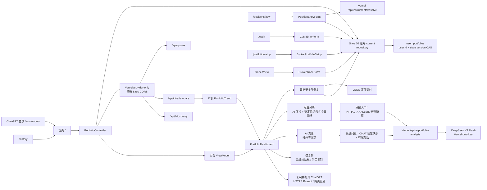

# 本地实现模块地图

状态：Active
最后更新：2026-08-22（统一组合现金修订）

## 1. 主判断

`[实现事实 2026-08-09]` 当前 P0 运行链路已经覆盖统一股票持仓、IBKR USD 现金、延迟行情、USD/CNY、JSON 导出与空组合 current-only 恢复、数据安全页、剪贴板复制、ChatGPT HTTPS Prompt 跳转、组合今日盈亏、组合结构/绝对贡献和 PWA 页面。首页使用紧凑总仓位标题、2 × 2 核心指标、更多操作、单一录入入口和五列共享横滑表。恢复与洞察代码位于已进入 GitHub `main` 的提交 `6e5832d`；ChatGPT 基础跳转已通过提交 `036ef60` 进入生产 `main`，短暂成功 Toast 已完成自动化验证，真机验收尚未完成。

`[实现事实 2026-08-09，历史本地阶段]` 当时工作区完成 Robinhood-inspired 英雄区与“今日”持仓估算线；该能力随后已进入 Vercel provider 和 Sites UI 双运行时。本段只保留当时自动化与浏览器 QA 证据，不再代表当前发布状态。

`[实现事实 2026-08-12]` 当前运行链路已收回为唯一“今日走势”：首页不显示长期周期或历史入口，`/history` 重定向首页，Controller 不再打开历史 repository、查询历史系列或自动记录 NAV。完整门禁通过 53 个测试文件、456 项测试及两项构建；390/320 px 本地生产页面与控制台检查通过。功能提交 `c609fa0` 已进入 GitHub `main` 和 Vercel Production，首页、历史重定向、标的、报价、SIP 走势、ECB 汇率及 manifest smoke 通过。历史解析、独立 IndexedDB 与 Modified Dietz 代码仍作为停用模块保留，不删除既有本机数据。

本文件只登记当前实现，不新增产品决定，也不复制规范公式：

- 产品范围以 `01-PRD.md` 为准；
- 数量、成本、行情、汇率、现金和今日变化公式以 `02-DOMAIN-AND-CALCULATIONS.md` 为准；
- 可见交互以 `03-UX-SPEC.md` 为准；
- 架构决定以 `adr/README.md` 及其中标出的 Accepted / Amended 现行 ADR 组合为准；
- 本文件负责说明代码实际位于哪里、是否进入 P0 运行路径、会写什么数据、由哪些测试约束。

`[实现事实 2026-08-09]` 恢复解析/repository 与组合洞察的针对性自动化已覆盖主要成功、拒绝、回滚、完整和部分状态。自动化通过不等于真实 Safari 跨 store 事务、真实 iPhone、生产发布或真实市场时段已经完成。

`[实现事实 2026-08-09]` ChatGPT 交付模块、所有复制入口和短暂成功 Toast 已接入首页；完整 `npm run check` 通过 42 个测试文件中的 388 项测试、TypeScript、领域构建和 Next.js 生产构建。基础跳转已完成生产部署；真实 iPhone 的 App 接管、网页回落、待发送状态和长文本仍待完成。

`[实现事实 2026-08-12]` 同一复制链路已增加显式 `clipboard | chatgpt` 目标；“更多操作”和股票菜单各提供普通复制与 ChatGPT 两个入口，普通复制只调用剪贴板并留在 PWA，ChatGPT 路径继续执行既有 HTTPS Prompt 交付。两者复用同一范围与文本生成器。

`[实现事实 2026-08-13]` 运行链路曾在“组合分析”接入 ADR-039 证据约束的 DeepSeek V4 Flash 最小事实解读；功能提交 `18f0d1c` 已进入 GitHub `main` 与 Vercel Production。这是已发布版本的历史实现记录；其最小事实发送面和一次性输出已被 ADR-041 的完整上下文多轮咨询取代。

`[实现事实 2026-08-15，历史 Production]` ADR-041 schema v2 单入口/同弹层版本曾在 Vercel Production 运行；它已被 ADR-042 双入口、schema v3 和 Sites Production 取代。本段只保留当时门禁与 smoke 证据。

`[实现事实 2026-08-15，Production]` ADR-042 双入口组件提交 `c5c7040` 与严格函数协议修复 `3b29842` 已进入稳定 Production。provider 通过 DeepSeek Beta strict function calling 按请求动态锁定全部持仓 key 与六维结构，服务端重新附着 positionId/symbol/basis，CHAT 只返回回答与基础 evidence；完整 `npm run check` 通过 65 个测试文件、525 项测试和两项构建。两轮独立的十只合成 Production 初始体检和连续两轮 `CHAT` 共六次请求全部返回 200，真机仍待完成。

`[实现事实 2026-08-15]` 功能提交 `058d3f8` 已删除固定个人 Production 启动载荷及 Controller 自动恢复调用，并进入 GitHub `main` 与 Vercel Production；production-like 空 repository 回归约束新来源保持空组合。完整 `npm run check` 通过 59 文件/490 测试与两项构建，生产依赖审计为 0；运行源码、本地产物和生产 17 个首页静态 chunk 扫描无旧载荷。隔离新来源、遗留标记和合成既有股票/现金 current 的 Production smoke 通过；已有股票、现金、草稿、缓存、独立历史库和旧 `localStorage` 完成标记均不迁移、不删除。最小合成 AI 请求返回 `200 / deepseek-v4-flash / no-store`，Production provider 成功链路已验证。

`[实现事实 2026-08-20，Production]` ADR-044 功能提交 `9aff4ed`、Security gate `32323114019` 和 Vercel deployment `7aXcqcMEY6zS3hrZedgcENhSQBuA` 均成功。`domain/broker-portfolio.ts`、schema v4 `broker_portfolio_v4`、双券商校准/BUY/SELL、双现金投影、JSON v3、`/portfolio-setup`、`/trades/new` 与 AI schema/prompt v3 已在稳定域名生效。完整门禁为 73 文件/558 测试及两项构建，生产依赖审计为 0；SRI、chunks 标识、公开路由、市场能力、合成 AI CHAT 和 390 px 控制台 smoke 通过。真实 iPhone 仍待验收。

`[实现事实 2026-08-20，双运行时 Production]` owner-only Sites 已发布到 `portfolio.example.com`。登录守卫、D1 migration、严格 `/api/portfolio`、身份伪名隔离、D1 CAS、CloudPortfolioRepository 与账号语义 UI 已进入运行包；没有导入真实持仓。Sites 五个 browser client 只在精确 Production origin 下转向固定 Vercel provider，CSP 只 allowlist 该 origin，Sites 无 provider secret 或公网直连标志。Vercel commit `e171abc`、Security gate `32356608866`、75 文件/563 测试与生产审计 0 通过；精确 CORS preflight、标的、`delayed_sip` 行情、SIP 15Min 条形、ECB 汇率和合成 schema v3 AI 生产 smoke 均成功。第二设备与真实 iPhone 仍待验收。

## 2. P0 运行链路

首页运行时不会调用旧账本同步模块；行情路由也不会实例化或调用独立的 Alpaca Market Clock adapter。

## 3. 运行模块

### 3.1 十进制、标的、时间与版本边界

- **代码：** `domain/decimal.ts`、`domain/instrument.ts`、`domain/time.ts`、`domain/errors.ts`、`domain/order.ts`、`domain/version.ts`。
- **职责：** 80 位十进制计算、最多 8 位输入小数、RFC 3339 纳秒级比较、规范标的键、稳定排序和计算版本保护。
- **写入：** 无。
- **证据：** `tests/decimal.test.ts`、`tests/supported-instruments.test.ts`、`tests/properties.test.ts`。
- **真源：** `02-DOMAIN-AND-CALCULATIONS.md` 第 2–4 节，ADR-010。

### 3.2 股票聚合、估值与今日盈亏

- **代码：** `domain/positions.ts`、`domain/quotes.ts`、`domain/portfolio.ts`，展示适配位于 `ui/portfolio-view-model.ts`。
- **职责：** 两种成本输入、同标的聚合、行情候选校验、上一有效价、组合完整性、累计浮动盈亏、今日盈亏估算金额与涨跌幅；现金不参与今日口径。
- **写入：** 领域层无写入；ViewModel 只生成展示值。
- **证据：** `tests/portfolio.test.ts`、`tests/quotes.test.ts`、`tests/properties.test.ts`、`ui/portfolio-view-model.test.ts`。
- **真源：** `02-DOMAIN-AND-CALCULATIONS.md` 第 4、6、7 节，ADR-010、ADR-024、ADR-025、ADR-027。

### 3.3 legacy 股票/现金快照与 Sites 本机草稿

- **代码：** `application/positions/types.ts`、`application/positions/indexeddb-position-repository.ts`、`components/position-entry-form.tsx`。
- **职责：** 在旧 Vercel origin 中兼容快照、现金与 JSON 导出；在 Sites 中只承载表单草稿。活动账号录入、修改、删除、校准与交易均由下节 CloudPortfolioRepository/D1 完成。
- **写入：** 旧 Vercel origin 可写 IndexedDB `position_batches_v2`、`cash_accounts_v3`、`broker_portfolio_v4` 等 legacy store；Sites 运行时只把 `position_drafts_v2` 作为本机辅助状态，不将这些 store 当作活动资产真值。
- **证据：** `tests/indexeddb-positions.test.ts`、`components/position-entry-form.test.tsx`。
- **真源：** ADR-011/015/017 的业务语义、已被 ADR-045 取代的 ADR-012 legacy 保护边界，以及 `04-TECHNICAL-SPEC.md` 第 6 节。

### 3.3A Sites 登录、D1 账号 current 与云 repository

- **代码：** `app/chatgpt-auth.ts`、`app/api/portfolio/route.ts`、`application/cloud/portfolio-api.ts`、`application/cloud/portfolio-state.ts`、`application/cloud/server/d1-portfolio-store.ts`、`application/cloud/browser/cloud-portfolio-repository.ts`、`application/portfolio-repository.ts`、`db/`、`drizzle/`、`worker/`、`vite.config.ts`、`.openai/hosting.json`。
- **职责：** 要求 ChatGPT 登录；优先按稳定 Sites user id、必要时按认证邮箱 SHA-256 伪名键选择账号 state；严格解析 current 写命令；在服务端复用领域校验；用 D1 `state_version` CAS 和业务 revision 防止多设备静默覆盖；同一账号跨设备读写同一 current。
- **写入：** D1 `user_portfolios`，每个用户一行严格 state。邮箱、姓名、原始 JSON、草稿、行情、汇率、历史和 AI 会话不写入。
- **本机：** `CloudPortfolioRepository` 只把表单草稿委托给旧 IndexedDB；上一有效行情和汇率缓存继续设备本地。
- **证据：** `tests/cloud-portfolio-state.test.ts`、全部既有 repository/领域/组件测试、Vinext build、本地 `/api/portfolio` 200 与 stale revision 409 smoke。
- **真源：** ADR-045、PRD FR-06/FR-07、`04-TECHNICAL-SPEC.md` 第 6 节。

### 3.4 标的解析

- **代码：** `application/instruments/`、`app/api/instruments/resolve/route.ts`，表单侧入口在 `components/position-entry-form.tsx`。
- **职责：** 只接收股票代码，服务端调用 Alpaca Asset API，校验 active、tradable、`us_equity`、受支持美国上市市场与固定 USD，再返回名称和规范市场。
- **写入：** 解析本身无写入；只有用户随后保存表单才写股票快照。
- **证据：** `tests/supported-instruments.test.ts`、`tests/alpaca-instrument-resolver.test.ts`、`tests/instrument-route.test.ts`。
- **真源：** PRD FR-01/FR-02、OQ-007、ADR-013。

### 3.5 股票行情、市场时段与上一有效价

- **代码：** `application/market-data/`、`app/api/quotes/route.ts`、`components/portfolio-controller.tsx`。
- **运行选择：** 路由使用 `AlpacaMarketCalendar`，失败时用 `inferUsEquityMarketSession()`；再由 `AlpacaMarketDataProvider` 与 `refreshMarketData()` 完成报价。隔夜对同一批标的请求 `overnight` 估值价和 `delayed_sip` 最近常规收盘参考，后者也承担无隔夜成交时的估值回退。
- **写入：** 浏览器将最后有效行情写入独立 IndexedDB `stock-portfolio-calculator-market-data/last_valid_quotes`；服务端路由另有进程内 `InMemoryLastValidQuoteStore`，只作单实例尽力缓存，不能当作持久真源。
- **证据：** `tests/market-data.test.ts`、`tests/quotes.test.ts`、`tests/indexeddb-quotes.test.ts`、`tests/alpaca-market-data-provider.test.ts`、`tests/alpaca-market-calendar.test.ts`、`tests/us-market-session.test.ts`、`tests/quote-route.test.ts`、`tests/quote-client.test.ts`、`components/portfolio-controller.test.ts`、`components/portfolio-controller-strict-mode.test.tsx`。
- **真源：** `02-DOMAIN-AND-CALCULATIONS.md` 第 7 节，ADR-003、ADR-016、ADR-019、ADR-020、ADR-027。

### 3.6 Historical Bars 与今日走势

- **代码：** `domain/portfolio-trend.ts`、`application/market-data/intraday-bars-api.ts`、`application/market-data/browser/intraday-bars-client.ts`、`application/market-data/server/alpaca-intraday-bars-provider.ts`、`app/api/intraday-bars/route.ts`、`components/portfolio-trend-chart.tsx`、`components/portfolio-controller.tsx`、`components/portfolio-dashboard.tsx`、`app/portfolio-premium.css`。
- **职责：** 唯一“今日走势”由服务端 SIP 15Min/split 条形与浏览器当前数量派生；不渲染范围选择器或长期结果，缺真值不画线。
- **写入：** 无；今日趋势不写 IndexedDB，Controller 不打开历史库。
- **证据：** `tests/portfolio-trend.test.ts`、`tests/alpaca-intraday-bars-provider.test.ts`、`tests/intraday-bars-route.test.ts`、`tests/intraday-bars-client.test.ts`、`components/portfolio-trend-chart.test.tsx`、`components/portfolio-dashboard.test.tsx`。浏览器已覆盖 320/390/430 px、390 同视口视觉对照、键盘探查、焦点返回和控制台；200% 文字、真实 iPhone 和真实市场时段待验收。
- **真源：** `02-DOMAIN-AND-CALCULATIONS.md` 第 6.3/7 节，ADR-034、ADR-037。

### 3.6A 停用的历史导入与未来事件

- **代码：** `application/history/`、`components/portfolio-history-center.tsx`、`app/history/page.tsx`。
- **职责：** 既有解析、存储和历史计算模块目前不进入产品运行路径；`app/history/page.tsx` 只负责重定向首页。
- **写入：** 只写独立历史 IndexedDB；原始文件/text 不持久化，不触碰 current 股票、现金、行情或汇率缓存。
- **证据：** `tests/portfolio-history.test.ts`、`tests/history-import.test.ts`、`tests/indexeddb-history.test.ts`、`components/portfolio-history-center.test.tsx`。
- **真源：** ADR-035（历史决定）、ADR-037（现行运行边界）。

### 3.7 USD/CNY 派生显示

- **代码：** `domain/fx.ts`、`application/fx/`、`app/api/fx/usd-cny/route.ts`、`ui/portfolio-view-model.ts`、`components/portfolio-controller.tsx`。
- **职责：** Alpaca `USDCNY` midpoint 优先，ECB 同日 USD/EUR 与 CNY/EUR 日参考价交叉汇率降级，15 分钟刷新节流、7 天缓存和整页 CNY 派生。
- **写入：** 只写 `localStorage` 键 `stock-portfolio:last-valid-usd-cny-rate:v1`；不写股票、现金或行情 IndexedDB。
- **证据：** `tests/fx.test.ts`、`tests/alpaca-usd-cny-rate-provider.test.ts`、`tests/ecb-usd-cny-rate-provider.test.ts`、`tests/fx-rate-route.test.ts`、`tests/fx-rate-client-cache.test.ts`、`ui/portfolio-view-model.test.ts`、`components/portfolio-dashboard.test.tsx`。
- **真源：** `02-DOMAIN-AND-CALCULATIONS.md` 第 8 节，ADR-008、ADR-022。

### 3.8 旧 v3 IBKR USD 现金

- **代码：** `domain/cash.ts`、`application/cash/types.ts`、`application/positions/indexeddb-position-repository.ts`、`components/cash-entry-form.tsx`、`app/cash/page.tsx`。
- **职责：** 单条 `IBKR:USD` 现金、Pro/Lite、可选 NAV、NAV fallback、公开利率快照和年/月利息估算；现金本金进入总资产，未入账利息不进入资产或盈亏。
- **写入：** 旧 Vercel origin 写 IndexedDB `cash_accounts_v3`；Sites 中的旧 cash current 通过 CloudPortfolioRepository 写入 D1，底层 IndexedDB store 只作 legacy 兼容。
- **证据：** `tests/cash.test.ts`、`tests/indexeddb-positions.test.ts`、`components/cash-entry-form.test.tsx`、`ui/portfolio-view-model.test.ts`、`components/portfolio-dashboard.test.tsx`。
- **真源：** `02-DOMAIN-AND-CALCULATIONS.md` 第 9 节，ADR-023。

### 3.8A 来源持仓 current book、统一组合现金、校准与交易

- **代码：** `domain/broker-portfolio.ts`、`application/brokerage/`、`application/cash/portfolio-cash.ts`、`application/positions/indexeddb-position-repository.ts`、`components/broker-portfolio-setup.tsx`、`components/broker-trade-form.tsx`、`app/portfolio-setup/`、`app/trades/new/`、Controller/Dashboard/ViewModel。
- **职责：** 固定 IBKR/moomoo 来源子持仓；内部已结算/待结算/负现金；显式校准；所有标的 BUY 成本与组合现金扣款；SELL 移动平均剩余成本与组合净卖出款；统一股票投影和单条组合现金展示。旧 v3 current 只作校准参考并原样保留。
- **写入：** Sites 活动 book 通过 `/api/portfolio` 和 D1 CAS 保存在 `user_portfolios` 的 current/previous/events 中；BUY/SELL 对完整 current 单次提交，来源股票、统一组合现金变化与事件同成败。旧 Vercel origin 仍保留 IndexedDB `broker_portfolio_v4/CURRENT` 作为 legacy JSON 来源。
- **证据：** `tests/broker-portfolio.test.ts`、`tests/broker-portfolio-backup.test.ts`、`tests/indexeddb-positions.test.ts`、`components/broker-portfolio-setup.test.tsx`、`components/broker-trade-form.test.tsx`、`components/portfolio-controller-broker-book.test.tsx`。
- **真源：** ADR-044、ADR-048、PRD FR-15、`02-DOMAIN-AND-CALCULATIONS.md` 第 5A 节。

### 3.9 JSON 手动导出、数据安全与空组合恢复

- **代码：** legacy `application/positions/position-backup.ts`、v4 `application/brokerage/backup.ts`、统一 repository/delivery/data-safety 页面。
- **职责：** 旧 current 生成/恢复严格 JSON v2；双券商 current 生成/恢复严格 JSON v3。两者优先 Web Share，取消不下载，解析/预览不写入；数据安全页按 format 路由并展示对应摘要。
- **写入：** v2/v3 都先在当前设备严格解析和预览；确认后 Sites repository 在同一 D1 CAS 中复查 positions/cash/broker 全空，只写 revision 1 / previous null 的规范化 current，失败零变化。原始文件不持久化，提示时间仍不是资产真值。
- **证据：** legacy 备份测试、`tests/broker-portfolio-backup.test.ts`、repository restore 测试、`components/data-safety-center.test.tsx`。
- **真源：** ADR-018、ADR-023、ADR-031、ADR-044，PRD FR-08、FR-12、FR-15。

### 3.10 组合结构与今日绝对贡献

- **代码：** `ui/portfolio-insights.ts`、`components/portfolio-insights-sheet.tsx`、`components/portfolio-controller.tsx`、`components/portfolio-dashboard.tsx`。
- **职责：** 从与首页同批的股票、行情和现金源派生组合结构、Top 1/3/5、现金权重、完整/部分今日净额、最大正负贡献和按绝对变化总量计算的逐股贡献；缺价和缺少前收保持不可用，不补 `0`。
- **写入：** 无。详情不读写 IndexedDB、不请求额外行情；CNY 只在展示层折算金额。
- **证据：** `ui/portfolio-insights.test.ts`、`components/portfolio-insights-sheet.test.tsx`、`components/portfolio-dashboard.test.tsx`。
- **真源：** `02-DOMAIN-AND-CALCULATIONS.md` 第 6.2 节、ADR-032、PRD FR-13。

### 3.10A DeepSeek 组合分析与独立 AI 对话

- **代码：** `application/ai/portfolio-consultation-api.ts`、`application/ai/browser/portfolio-consultation-client.ts`、`application/ai/server/deepseek-portfolio-consultant.ts`、`application/ai/server/sliding-window-rate-limiter.ts`、`ui/portfolio-consultation-context.ts`、`app/api/ai/portfolio-analysis/route.ts`、`components/portfolio-ai-consultation-panel.tsx`、`components/portfolio-ai-chat-dialog.tsx`、`components/portfolio-insights-sheet.tsx`、`components/portfolio-dashboard.tsx`。
- **职责：** 从当前 `PortfolioCopySource` 与 `PortfolioInsights` 生成 schema v3 current-only USD 完整快照并固定调用 `deepseek-v4-flash`。schema v3 包含统一组合现金与底层兼容分量；“组合分析”点按后发起 `INITIAL_ANALYSIS`，“AI 对话”打开零请求、发送时发起 `CHAT` 并固定首次发送快照。模型分类、六维体检、证据、本机 Decimal 数字重绘和不合规输出整份拒绝边界不变。
- **写入：** 无资产或浏览器持久化写入。分析结果与聊天会话分别只保留在各自 React dialog state；父页自动刷新不替换已开始的聊天快照，关闭或页面刷新即清除。重新打开组合分析会用当时最新快照自动开始，重新打开聊天为空且仍不请求。服务端只使用进程内哈希 caller 限流 bucket；`DEEPSEEK_API_KEY` 只存在服务端。
- **证据：** `tests/portfolio-consultation-api.test.ts`、`ui/portfolio-consultation-context.test.ts`、`tests/deepseek-portfolio-consultant.test.ts`、`tests/portfolio-ai-route.test.ts`、`tests/portfolio-consultation-client.test.ts`、`tests/sliding-window-rate-limiter.test.ts`、`components/portfolio-ai-consultation-panel.test.tsx`、`components/portfolio-ai-chat-dialog.test.tsx`、`components/portfolio-insights-sheet.test.tsx`、`components/portfolio-dashboard.test.tsx`。
- **真源：** ADR-042、ADR-041（经修订）、PRD FR-14、`04-TECHNICAL-SPEC.md` 第 6.6 节。ADR-039 对应的 v1 模块仍留在仓库，但当前 route 与 UI 不再导入。

### 3.11 低噪音持仓复制与双目标交付

- **代码：** `ui/portfolio-copy-text.ts`、`application/positions/browser/copy-portfolio-text.ts`、`application/positions/browser/deliver-chatgpt-prompt.ts`、`components/portfolio-controller.tsx`、`components/portfolio-dashboard.tsx`。
- **职责：** 前 5、前 10、全部或单只低噪音资料，使用未舍入市值排序、权重与排名，并提供 `clipboard | chatgpt` 两个目标。普通复制只调用系统剪贴板；ChatGPT 路径先调用剪贴板，再在第一次异步等待前同步导航到 `https://chatgpt.com/?prompt=<编码后的同一文本>`。两个目标复用同一当前内存文本，失败时保留目标专属手工回退。
- **写入：** 两个目标都只可能写系统剪贴板；只有 ChatGPT 目标通过 `globalThis.location.assign()` 把编码 Prompt 交给 `chatgpt.com`。均不重新读取或写入 IndexedDB，不调用行情、本产品上传 API 或 OpenAI API。
- **证据：** `ui/portfolio-copy-text.test.ts`、`tests/copy-portfolio-text.test.ts`、`tests/deliver-chatgpt-prompt.test.ts`、`components/portfolio-dashboard.test.tsx`。专项测试覆盖显式目标、共享范围、普通复制零导航、ChatGPT 调用顺序与 URL 编码、目标专属 Toast 和手工回退；真实 App/网页行为不能由模拟证明。
- **真源：** ADR-021、ADR-023、ADR-026、ADR-033、ADR-038，PRD FR-09。

### 3.12 首页、表单与 PWA 壳

- **代码：** `app/`、Controller/Dashboard/Trend、legacy 表单、双券商 Setup/Trade 表单、ViewModel 与样式。
- **职责：** 首页英雄区、总资产、当日线、2 × 2、统一股票与单条组合现金五列表、复制/AI；legacy 录入；v4 校准、买入、卖出、旧入口转向，以及移动端加载/错误/无障碍/PWA 壳。PWA metadata 与 manifest 复用 `app/pwa-branding.ts`，ADR-047 图标指向固定 Vercel 静态 origin；Vercel 匿名 PNG 已通过 `200 image/png` 与跨源 header smoke，Sites 登录态 metadata 和真机安装仍待验收。
- **写入：** 由明确用户操作调用对应 repository；前台行情每 60 秒检查刷新，汇率最多每 15 分钟尝试一次。
- **证据：** `components/*.test.ts(x)`、`ui/*.test.ts`、Next.js 生产构建。
- **真源：** `03-UX-SPEC.md`、ADR-001、ADR-013、ADR-020、ADR-025、ADR-027、ADR-029、ADR-030、ADR-034。

### 3.13 服务端与生产边界

- **代码：** 五个 `app/api/` provider 路由组（标的解析、当前报价、当日条形、USD/CNY、AI 组合解读）、`application/http/provider-proxy-contract.ts`、`application/http/provider-proxy-cors.ts`、`application/http/request-security.ts`、`application/http/public-route-rate-limiters.ts`、`application/fx/server/usd-cny-route-cache.ts`、`application/ai/server/sliding-window-rate-limiter.ts`、`next.config.ts`、`worker/index.ts`、`.github/`。
- **职责：** 固定 Sites/Vercel origin；五个 browser client 只在精确 Sites origin 下转向 Vercel；Vercel API 只对该 Sites origin 返回无 credentials CORS，并继续执行字节、字段、限流、固定上游与响应上限。Sites owner-only 与 D1 认证是独立边界；CORS 不是认证。ADR-047 另为无敏感 PNG 增加 `/icons/` 匿名静态例外，不扩大 API 边界。
- **写入：** provider 路由零资产写入。Vercel 无 `/api/portfolio`，不读写 Sites D1、原始 JSON、草稿或历史库；AI 仅处理用户主动触发的 current-only 快照，不持久化。
- **证据：** `tests/provider-proxy.test.ts`、`tests/provider-proxy-clients.test.ts`、route/adapter/request-security/security-headers 测试；Vercel 75 文件/563 测试、Security gate `32356608866` 与五项生产 smoke。
- **真源：** ADR-013、ADR-014、ADR-041、ADR-043、ADR-045、ADR-046，`09-PRODUCTION-OPERATIONS.md`。

## 4. 已移除或存在但不属于当前 P0 运行功能

| 资产 | 当前事实 | 边界 |
|---|---|---|
| 个人 Production bootstrap（已删除） | 固定载荷模块、Controller 启动调用和旧专项测试已从本地工作区移除；由空来源回归测试取代 | 新来源不自动写入资产；既有 current、独立历史库和旧完成标记保持原样。以 ADR-040 为准 |
| `domain/ledger/` | 仍实现旧 OPENING/BUY/SELL/RECONCILIATION 和 `BrokerPosition` | 停用历史模型；ADR-044 的 current BUY/SELL 只来自 `domain/broker-portfolio.ts`，不继承旧账户或税务语义 |
| `application/sync/` | 有本地 store、outbox、游标、冲突与同步编排测试 | 首页与表单不导入；没有真实 transport、登录或云端。其旧 IndexedDB adapter 与 P0 repository 默认数据库同名，禁止同时接入 P0 运行链路 |
| `application/market-data/server/alpaca-market-clock.ts` | adapter 由 server barrel 导出并有独立测试 | `app/api/quotes/route.ts` 不引用或实例化它；当前时段真值来自市场日历和 New York 24/5 fallback |
| `FixtureMarketDataProvider` 与 `ui/portfolio-fixtures.ts` 中的合成数据 | 用于确定性测试和组件状态 | 不连接生产行情；但 `PortfolioFixture` 类型目前也被生产 ViewModel、Controller 和 Dashboard 复用，文件名不能据此推断整个文件只在测试运行 |
| `PositionRepository.undoLatest()` | repository 内部能力已实现并测试 | 首页和普通用户路径没有“恢复上一版”入口，不能当作产品功能 |
| Playwright 依赖与 `npm run test:e2e` | `package.json` 已有脚本和依赖 | 截至 2026-08-08，没有 `playwright.config.*`、E2E 目录或 `*.spec.*`；当前不是可计入门禁的浏览器 E2E 套件 |

## 5. 数据与外部状态清单

| 位置 | 内容 | 真值级别 | 失败边界 |
|---|---|---|---|
| Sites D1 `DB/user_portfolios` | 账号 legacy current 或 v4 book current/previous/events | Sites 唯一活动资产真值 | user id 隔离；state/business 双 revision；失败零变化 |
| IndexedDB `stock-portfolio-calculator-ledger` v4 | 旧 Vercel 股票/IBKR/v4 current 与 Sites 本机草稿 | legacy 迁移来源；Sites 中只有草稿为活动辅助状态 | 不自动上传或改写；经 JSON 显式迁移 |
| IndexedDB `stock-portfolio-calculator-market-data` v1 | 每个标的最后有效行情 | 可替换缓存 | 失败不改变股票数量或成本 |
| `localStorage` USD/CNY v1 | 最后一笔有效汇率及来源元数据 | 最多 7 天的展示缓存 | 无效或过期时继续 USD，禁止回退为 0 |
| `localStorage` 数据安全提示 | 最近生成 JSON 与最近成功恢复时间 | 设备内提示，不是资产或备份真值 | 失败不得提前更新时间；生成时间不能证明文件已保存 |
| 升级前来源可能遗留的 personal bootstrap 完成标记 | 已停用的本机标记；当前代码不再读取或写入 | 非资产、非运行状态 | 为避免额外迁移风险，本次不主动清理；它不会触发任何恢复 |
| 服务端进程内行情 map | 单个 Next.js 实例的上一有效行情 | 非持久、非共享的尽力缓存 | 实例重启或切换后可消失，不能作为恢复保证 |
| 内存当日趋势 | SIP 15Min Historical Bars 按当前数量与现金派生的只读点 | 可替换展示结果，非真值 | 刷新或请求失败可消失；不写 IndexedDB，不改变持仓或当前估值 |
| 系统剪贴板 | 用户主动选择的结构化资料 | 临时外部状态 | 失败转手工复制，不改应用数据 |
| `https://chatgpt.com/?prompt=` | 用户最终选择后编码的同一结构化资料 | 用户触发的外部交付 | App 可接管或网页回落；不自动发送。完整 URL 不得进入本站日志、缓存、分析事件或测试证据，长文本与路由需真机验证 |
| Web Share / Blob 下载与文件选择 | 旧 JSON v2 或 v4 JSON v3 文件 | 用户自行保管的副本 | 只可在账号 positions/cash/broker 全空时恢复；不合并/覆盖，原始文件不持久化，Vercel provider 不接收 |
| OpenAI Sites | owner-only Web/PWA、ChatGPT 登录、D1 `/api/portfolio` 和账号 current | UI/认证/资产真值 Production | Sites public beta、配额与无 data residency；无 provider secrets，不直连 Alpaca/ECB/DeepSeek |
| Vercel | 五个 provider-only 路由、ADR-047 公开只读 PWA 图标、Alpaca/DeepSeek Sensitive secrets 与 legacy Web/PWA | provider Production + 安装静态资产 + 旧 origin JSON 导出来源 | API 只对精确 Sites origin 开放无 credentials CORS；匿名图标已通过 `200 image/png` 与跨源/immutable header smoke；不读写账号 current |

## 6. 当前验证缺口

- 没有完整浏览器 E2E spec；`npm run test:e2e` 目前只是脚手架入口。
- 真实 Safari/IndexedDB 的 schema v2→v3、容量异常和恢复路径尚未完成设备验证。
- 真实 iPhone 的 JSON v2/v3 文件选择、D1 CAS 空账号恢复、冲突零变化和同账号第二设备刷新尚未完成验证；旧 Safari/IndexedDB 跨 store 测试只属于 legacy 兼容。
- 真实 iPhone Safari 与主屏幕模式的录入、普通复制留页/跨应用粘贴、ChatGPT App 接管/网页回落/待发送状态/长文本、JSON 文件保存/选择/空账号恢复、组合结构/今日贡献、统一组合现金、CNY、今日盈亏、200% 文字和 VoiceOver 尚未形成完整闭环证据。
- ADR-047 的 Vercel 图标生产 `200 image/png` 与跨源 header 已通过；Sites 登录态 metadata/manifest 指向和真实 iPhone 重新安装仍待验收。
- 本地浏览器已验证 320/390/430 px 的高级首页无页面级横向溢出，390 同视口视觉对照 Passed，键盘趋势探查、更多、组合分析、焦点返回和五列滚动已通过，控制台无 error/warning。200% 文字、真实 iPhone 和真实市场时段尚未验收。
- 常规盘、盘后和实际隔夜时段仍缺时间绑定生产 smoke；`overnight` 还需核对具体账户权限与返回类型。
- Vercel Production 的 ECB 可达性已通过；Alpaca `USDCNY` 优先权限、实际 `overnight` 时段和双源失败 UI 仍需时间绑定/真机验收。
- P0 已有 ChatGPT 登录、D1 current 和同账号跨设备读取。Service Worker、向已有组合合并/覆盖、自动版本化云备份、跨账号共享与完整离线仍是明确边界，不是遗漏模块。

## 7. 维护规则

1. 新增或移除一个 P0 运行模块、路由、持久化位置或外部写入时，同步本文件和 `04-TECHNICAL-SPEC.md`。
2. 产品行为变化先更新 PRD、领域/UX 真源和 ADR；本文件只记录实现落点，不反向批准需求。
3. 只有实际被页面或 API 导入的代码才能标为“P0 运行模块”；仅有导出、测试或 npm 脚本不能证明已接入。
4. 测试数量只在实际执行后更新，并继续区分自动化、浏览器 E2E、真实外部服务与真实 iPhone 证据。
